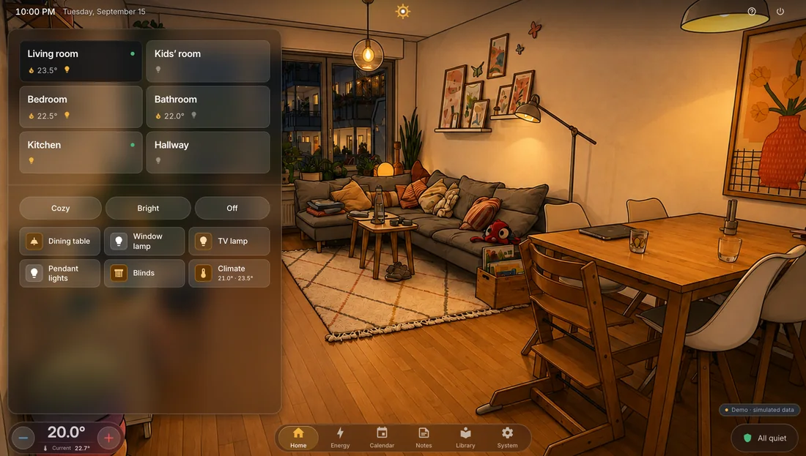
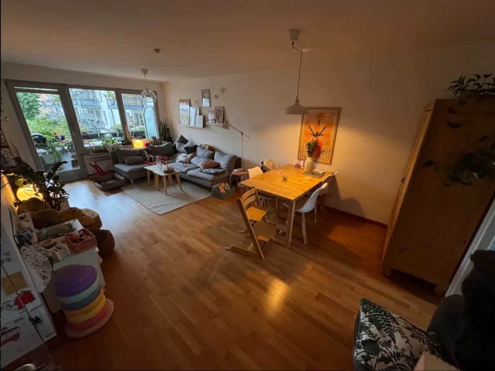
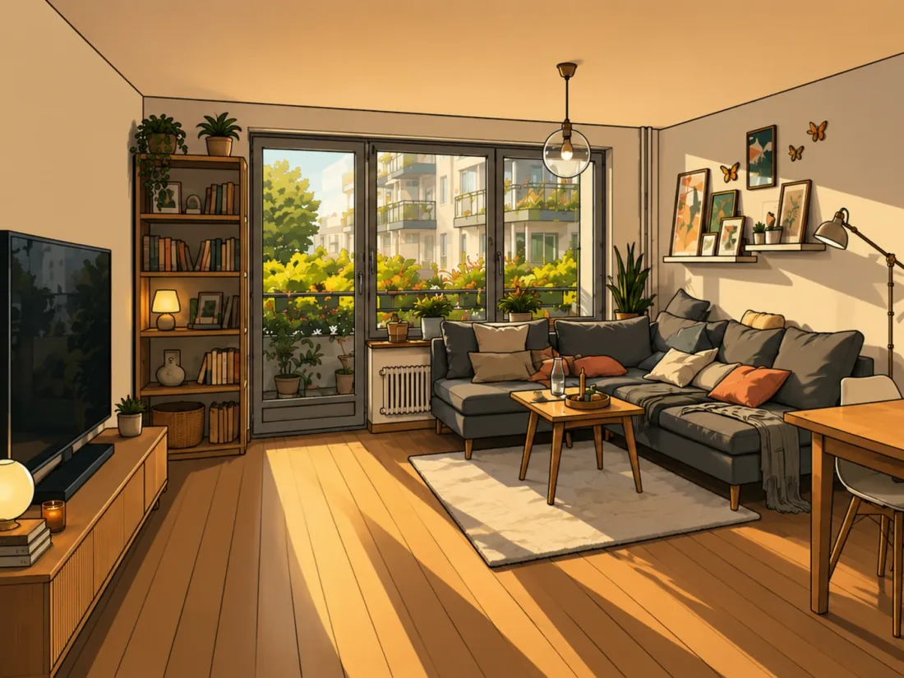
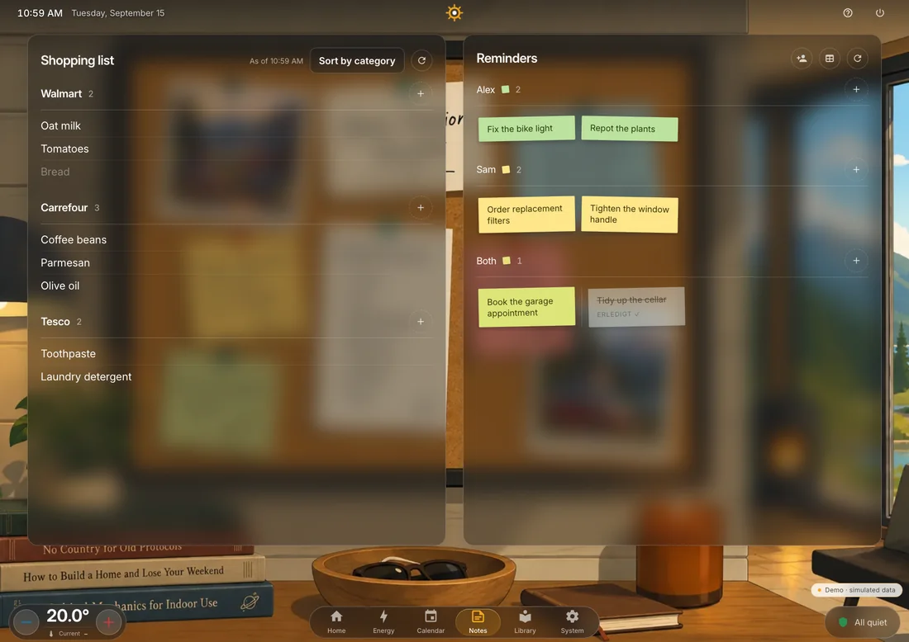
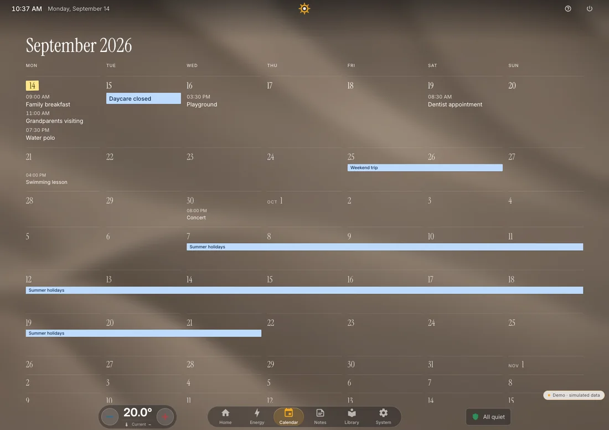
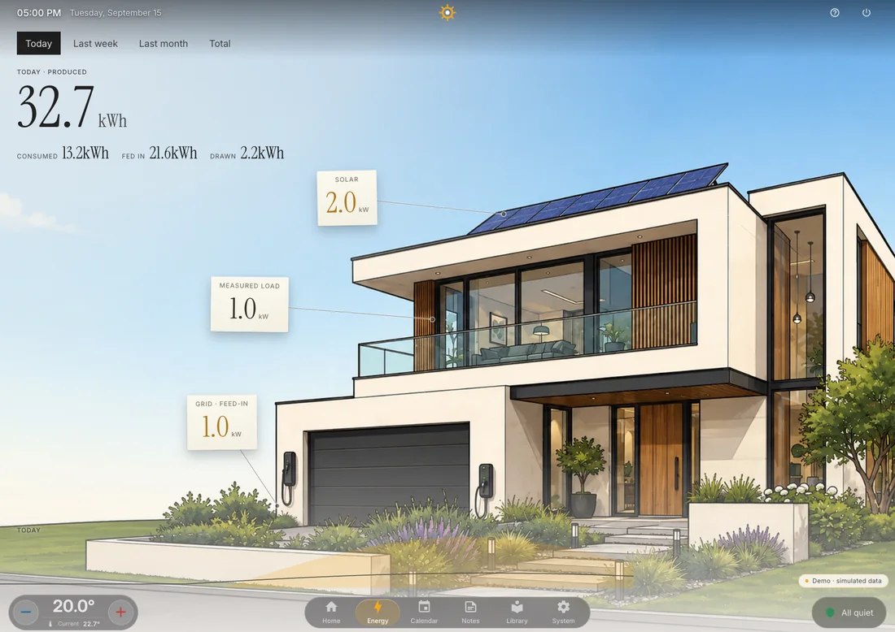
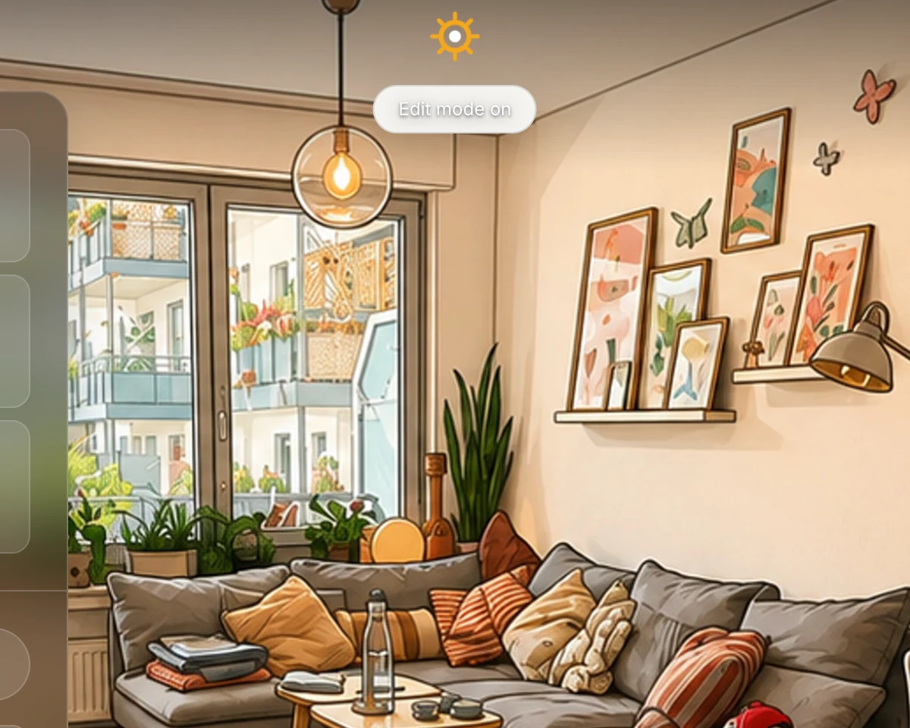
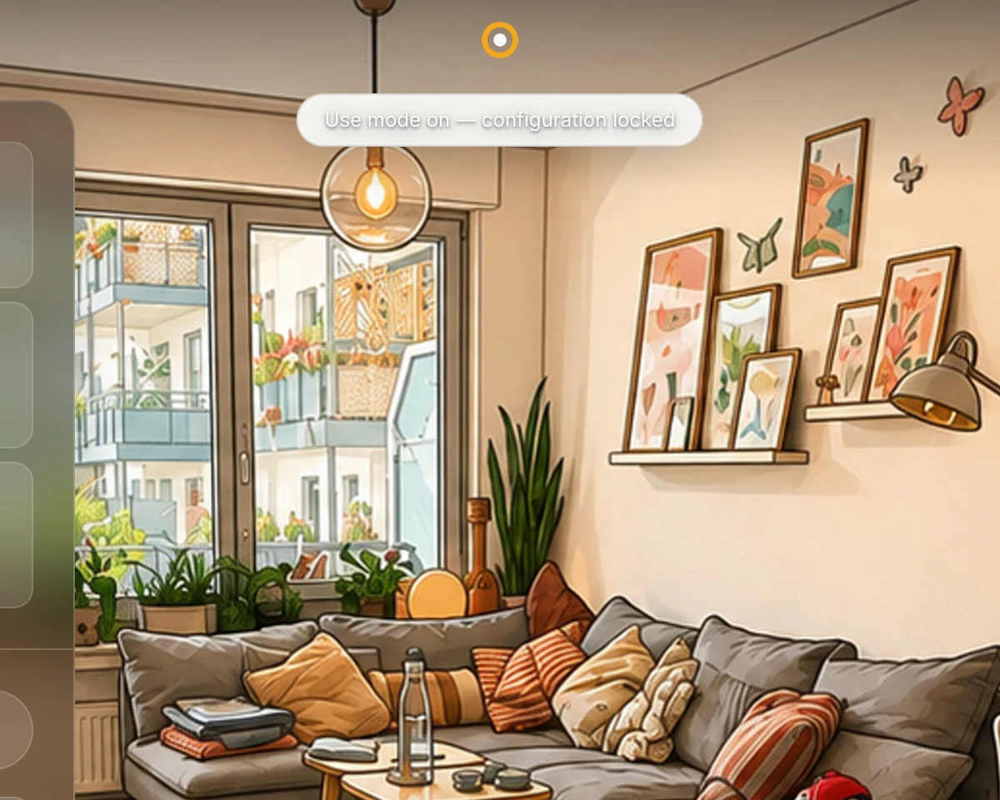

<div align="center">

<picture>
  <source media="(prefers-color-scheme: dark)" srcset="app/public/brand/hauser-logo-dark.svg">
  <source media="(prefers-color-scheme: light)" srcset="app/public/brand/hauser-logo-light.svg">
  
</picture>

**A calm, visual Home Assistant frontend for the people who live in the home.**

[**Project page**](https://ralleur.github.io/hauser/) · [**Live demo**](https://ralleur.github.io/hauser/demo/) · [Install](#installation) · [Documentation](#documentation) · [Roadmap](ROADMAP.md)

[](https://github.com/ralleur/hauser/actions/workflows/quality-and-release.yml) [](https://github.com/ralleur/hauser/releases) [](LICENSE)

</div>

Hauser is a self-hosted, room-first Home Assistant dashboard for wall panels,
tablets and phones. Home Assistant remains the operator and admin interface;
Hauser is the calm everyday interface for family members and the rest of the
household.

<picture>
  <source media="(prefers-color-scheme: dark)" srcset="website/media/lockscreen-dark.webp">
  <source media="(prefers-color-scheme: light)" srcset="website/media/lockscreen.webp">
  
</picture>

Standby is the default resting state, and it is where a wall panel spends most
of its day: readable from across the room, quiet until touched, and a direct
path into the household view behind whatever you touched. The map behind it is
your own neighbourhood — rendered once on the server from OpenStreetMap data
around the location Home Assistant already knows, then used as a mask in the
current text colour. That is why the picture above follows your own
light or dark preference: it is the same file either way.

---

## Beta status

Hauser is an **installable, self-hosted smart home interface in its first public
technical beta**. It is an AGPL-licensed hobby project, not a commercial service
and not a promise of support.

The portable product deliberately excludes the author's private code-modifying
AI agent. That workflow depends on a trusted development checkout, commit/push
rights and host deployment tooling; granting a read-only Docker installation
those capabilities would violate the product's security and persistence model.
This boundary does not apply to bounded, non-code-modifying AI functions.

The current branch contains a source-built Docker Compose installation,
versioned external household configuration, a deterministic setup wizard,
automatic configuration migration, persistent volumes, backup/restore and a
documented rollback path. The isolated clean-room pilot has completed setup,
control/state echo, reconnect and persistence without source changes.

`v0.4.0-beta.1` was the first public release. Its versioned GHCR image is the
normal installation path; `v0.7.0` is current. The first installation by
an external person in a second household is confirmed: Docker Compose on an
Asustor NAS (Linux, x86_64) against Home Assistant Container, with automatic
area discovery and the first light under control ten minutes in — see
[issue #7](https://github.com/ralleur/hauser/issues/7). That report surfaced
discovery gaps for switches, media players and vacuums (fixed in `beta.5`) and
a reconfigure save that silently failed (fixed in `beta.7`); real-hardware
vacuum confirmation is still outstanding. Further external installations and
release-to-release upgrades remain part of beta stabilisation — see
[the roadmap](ROADMAP.md).

The hosted static demo runs the real interface against simulated devices. It
never connects to a visitor's Home Assistant or to the maintainer's private
services.

---

## Why it exists

Home Assistant is an excellent automation engine. Its dashboard is a grid you
fill with cards, each written by a different author, each with its own spacing,
motion, and idea of what a button feels like. It works, and it never quite
feels like one product.

Hauser takes the other path:

- **One design system.** Every surface comes from the same tokens, type scale
  and motion spec — see [`design-tokens/`](design-tokens/) and
  [`docs/01-design-system.md`](docs/01-design-system.md).
- **Optimistic UI.** Tap a light and it turns on immediately; the command
  travels afterwards. When the house disagrees, the control animates back to
  the truth instead of quietly lying. See
  [`docs/02-interaction-contract.md`](docs/02-interaction-contract.md).
- **A performance budget treated as a requirement.** Under 16 ms from touch to
  visible feedback, transform and opacity only, no layout thrash. See
  [`docs/03-performance-budget.md`](docs/03-performance-budget.md).
- **Backends without visible seams.** Home Assistant, Jellyfin, calendar data,
  shared household data and the optional Paperless bridge keep their own
  transport boundaries while the interface presents one design system.

The public documentation describes the architecture that is active now. It
deliberately omits superseded plans and rejected alternatives.

## What it does

| Area | |
|---|---|
| **Rooms** | Climate, lights, scenes, presence and window state; each room illustrated in three lighting states that follow the actual lights |
| **Room images** | The bundled illustrations are of the author's home, so the built-in wizard makes yours from a phone photograph: day, evening and lights-off as one reviewed set. Needs your own OpenAI access, and it is the only paid third party in the product |
| **Home Assistant** | WebSocket via the official client, optimistic commands with reconciliation, reconnect handling, day/night theming from `sun.sun` |
| **Media** | Jellyfin library, shelves, detail view, HLS playback with resume; room audio through HA media players |
| **Energy** | Live load and daily consumption from real power sensors, with honest empty states for figures the house cannot measure |
| **Everyday** | Calendar, notes, reminders, shopping list, laundry notifications |
| **Documents** | PIN-gated Paperless-ngx search, preview, download and import through the optional companion server |
| **Devices** | Add, hide, rename, assign to a room and reorder entities from inside the UI |
| **Edit and use** | One switch per device separates configuring from operating: use mode closes every configuration door and leaves every control working, optionally behind a PIN and with an idle timeout |
| **Standby** | A calm lockscreen with clock, week strip, notes and shopping list; optionally a faint street map of your own town, rendered once on the server from OpenStreetMap data ([details](docs/07-configuration.md#standby-city-map)) |
| **Two shells** | A landscape wall panel and a one-handed phone layout, sharing one design system |
| **Hotel mode** | Optional, off by default: turns a dedicated panel into a guest surface for one holiday apartment — stays from a Home Assistant calendar, a default-deny device release, a PIN-gated admin session and a guest checkout ([details](docs/07-configuration.md#hotel-mode-holiday-apartment)) |

### Integration status

This distinction matters because the static demo, an implemented adapter and a
configured live service are not the same thing:

| Integration | Repository implementation | Static beta demo |
|---|---|---|
| **Home Assistant** | Implemented. The official WebSocket client supplies entity state, commands, reconciliation and reconnects. | Simulated entities; no connection to a live HA instance. |
| **Jellyfin** | Implemented. A dedicated REST client handles authentication, shelves, browse and detail data; playback uses PlaybackInfo, HLS and progress reporting. | Curated simulated library data; no connection to a live Jellyfin server. |
| **Calendar** | Implemented through Home Assistant, not as a separate calendar backend. Hauser discovers `calendar.*` entities and reads events with HA's `calendar/list` WebSocket command. The settings UI can also start HA's iCloud/CalDAV config flow. | Curated simulated events. |
| **Reminders** | Implemented by the optional companion server as central household data. Selected HA `todo.*` lists can additionally be merged through WebSocket. | Curated simulated data. |
| **Shopping** | A local server-side bridge keeps the HMI and a shared Notion shopping page in sync without exposing the Notion token to the browser. | Curated simulated data; no Notion connection. |
| **Paperless-ngx** | Implemented by the optional companion server. It keeps the Paperless token and PIN server-side and exposes only gated search, processing status, preview/download and import operations. | Deliberately omitted; private documents do not belong in a public static demo. |
| **OpenStreetMap / Overpass** | Optional and off by default. When a location is configured, the server queries a public Overpass endpoint once and renders a monochrome road SVG for the standby background. Map data © OpenStreetMap contributors, ODbL. | Not connected; the demo ships no generated map. |
| **OpenAI** | Optional and inert until you supply your own access, either an API key or a signed-in ChatGPT account. Used by the room-image wizard only: the photo you pick is sent to the images endpoint to be redrawn. No other feature calls it, and the key stays server-side. | Deliberately omitted; the demo ships the bundled illustrations and never calls a paid provider. |
| **Notion** | Optional private integration for the shared shopping list only. Reminders do not depend on Notion. | Not connected; shopping uses fixtures. |

## Screenshots

All of these are unretouched captures of the interface in the hosted demo.

### The same room, morning and evening

| | |
|---|---|
|  |  |
| **Day** — controls stay narrow so the room stays visible | **Night** — same layout, same second; only the sun moved |

Nobody in the household reaches for a theme setting. The interface follows
`sun.sun`, and each room carries an illustration of itself in three lighting
states that follow the actual lights.

### Where those room illustrations come from

| | |
|---|---|
|  |  |
| **Input** — evening light, a wide-angle lens, toys on the floor | **Output** — the same room, and the image that ships as the living room today |

The illustrations bundled with Hauser are of the author's home, which is no use
to yours. The room-image wizard makes yours from a photograph you take with
your phone: you choose the crop and the focus point, the first pass may correct
perspective, and after that the camera, geometry and object positions are
frozen so that what comes back is still your room rather than a stock living
room that resembles it. Day, evening and lights-off are generated as one set,
reviewed together and published atomically.

This is the one place where Hauser talks to a paid third party. It needs your
own OpenAI access, your photograph is sent there to be redrawn, that trade is
stated before anything is uploaded, every paid step is confirmed by hand, and a
running count of provider calls stays on screen. The wizard is not part of the
hosted demo.

### The screens a household opens most

| | |
|---|---|
|  |  |
| **Everyday** — a colour per person, a group per shop | **Calendar** — Home Assistant's calendar entities as one month |
|  |  |
| **Library** — Jellyfin, built in the same design system. The demo invents its titles and draws colour fields instead of real cover art | **Energy** — real sensors, and honest gaps where there is no meter |

### Two shells, one design system

<div align="center">
  
</div>

The phone layout is not a squeezed panel. Navigation moves to the thumb as a
floating bar, rooms become a drill-down instead of an overlay, and the
destinations you use most sit in that bar in an order you choose. The tokens,
motion and interaction rules are identical to the wall panel's.

### Set it up once, then hand it to the household

| | |
|---|---|
|  |  |
| **Edit** — rays on the mark, and a long-press opens configuration | **Use** — the same mark one step calmer; every control keeps working |

One mark in the middle of the title bar carries the mode, and the mode belongs
to the device rather than to the household: the hallway panel can be locked
while your own phone keeps configuring. A PIN can guard the way back to
editing, and the panel can drop into use mode by itself after an idle timeout.
Someone who tries a locked long-press twice is told where the switch is,
because once might have been an accident.

## Architecture

```
Wall panel (kiosk tablet)            Phone (home-screen PWA)
        └──────────── same origin ────────────┘
                        │
              Hauser PWA  ← this repository
                        │
        ┌───────────────┴────────────────┐
        │ same-origin HTTP + WS          │ straight from the browser
        ▼                                ▼
  Hauser server (app/server.mjs)   Jellyfin REST + HLS
  · household config, validated      library, playback
  · Home Assistant gateway
  · room-image store, map renderer
  · Paperless / Notion bridges
        │
        ▼
  Home Assistant  ←── or straight from the browser (Compose, `direct`)
  devices, energy, calendar.*, todo.*
```

The app is Svelte 5 + Vite, with a four-layer adapter between the UI and the
backends: an entity store holding server truth, an overlay of pending intents, a
command queue, and a swappable backend. The UI only ever reads `merged()` and
writes `dispatch()`. That seam is what makes both the optimistic behaviour and
the offline demo possible.

There are two transports to Home Assistant behind the same backend seam. As a
**Home Assistant App**, only the server talks to Home Assistant, through the
Supervisor — the browser never receives a token, and you never type a Home
Assistant URL. With **Docker Compose**, the browser connects directly to the
instance you configure during setup. `/api/ha/connection` reports which mode is
active.

The server (`app/server.mjs`) also holds the validated household configuration,
the room-image store, the standby map renderer, centrally stored reminders, the
same-origin proxy for the local Notion shopping bridge and the PIN-gated
Paperless-ngx bridge. Integration credentials stay server-side and are never
shipped to the browser. In Compose deployments the optional bridges can be left
unconfigured; rooms, lights, climate, calendar, media and energy work without
them. The public demo has no Notion dependency.

## Installation

Two supported paths. On Home Assistant OS and Supervised installations the
packaged App is the short one; Home Assistant Container, plain Docker hosts and
NAS systems use Docker Compose. Both end in the same guided setup wizard.

### As a Home Assistant App

[](https://my.home-assistant.io/redirect/supervisor_add_addon_repository/?repository_url=https%3A%2F%2Fgithub.com%2Fralleur%2Fhauser)

1. Use the button above, or open **Settings → Apps → App Store → Repositories**
   and add `https://github.com/ralleur/hauser` by hand.
2. Select **Hauser**, choose **Install**, then **Start**.
3. Choose **Open Web UI** and run the setup wizard.

The App connects to Home Assistant itself: it declares `homeassistant_api` and
the Hauser server talks to Home Assistant Core over the internal Supervisor
endpoints. There is no field for a Home Assistant URL and no Long-Lived Access
Token, and neither is stored in `/data` or handed to the browser. The wizard
ends by showing the exact address phones and tablets use, with a copy action and
a QR code.

The App is a thin packaging layer around the same multi-architecture image
(`aarch64`, `amd64`) and stores all state in Home Assistant's persistent `/data`
directory, so App backups cover the household configuration. This packaging
deliberately uses a direct LAN port instead of Ingress, and that port carries no
separate login and no device pairing: every device that reaches it on the
trusted network can operate Hauser. Keep it on a trusted network and do not
publish it to the internet.

The manifest declares `stage: experimental`. On `v0.6.1` a fresh install,
start, credential-free setup discovery, activation, the internal Home Assistant
connection and opening the displayed address from a real phone were verified on
an isolated Home Assistant OS test system; real device commands with state echo,
reconnect after a restart and backup/restore last passed on an earlier version
and were not re-verified here. None of it has been tried across other people's
installations yet.
[`hauser/DOCS.md`](hauser/DOCS.md) documents the packaging, persistence,
backup/restore and current limitations in full.

Apps require Home Assistant OS or a Supervised installation. Home Assistant
Container has no App system — use Compose below.

### With Docker Compose

The release Compose file pulls the versioned public image and starts it with
persistent config, data and asset volumes:

```bash
cp .env.example .env
docker compose pull
docker compose up -d
docker compose ps
docker compose exec hauser node container/healthcheck.mjs
```

The image `ghcr.io/ralleur/hauser:v0.7.0` is published only after the
matching public beta tag passes the release workflow. Tagged releases also
publish the plain `0.7.0` tag, which the Home Assistant Supervisor
resolves from the App manifest. When deliberately building
from a checkout instead, use the explicit source-build overlay:

```bash
docker compose -f compose.yaml -f compose.build.yaml up -d --build
```

Open <http://localhost:4173>. The default bind is loopback-only; LAN exposure
must be enabled deliberately in `.env`. The complete installation, health,
backup, restore, update and rollback contract is documented in
[`docs/08-installation.md`](docs/08-installation.md).

On first start, the setup wizard guides you through:

1. choosing the interface language;
2. connecting to Home Assistant — as the Home Assistant App this is automatic
   and asks for nothing; with Docker Compose it tests the Home Assistant URL and
   long-lived access token you provide;
3. discovering Areas and relevant entities;
4. reviewing, renaming and ordering Hauser rooms and assigning devices;
5. enabling or skipping Jellyfin;
6. validating and atomically activating the configuration.

No source edit is required. Later changes are available directly under
**System → Home → Rooms & devices**. Home Assistant Areas are only read as input;
Hauser does not rename or delete them.

A clean checkout can also produce a commit-bound local image with
`./scripts/build-image.sh`; set its reported repository and tag in `.env` before
starting Compose. The release workflow publishes only after an explicit version
tag whose value matches `package.json`.

## Running the developer build

```bash
cd app
npm install
npm run dev
```

That starts against a fake backend with simulated devices, which is the fastest
way to look around.

For the complete installation and first-run flow, use the isolated development
pilot instead. It starts a synthetic Home Assistant and a fresh Hauser instance
with separate containers, credentials and volumes:

```bash
./scripts/dev-pilot.sh up
```

See [`docs/09-dev-pilot.md`](docs/09-dev-pilot.md) for onboarding, persistence,
reset and isolation details.

Run the publication-gate test suite with:

```bash
cd app
npm test
```

### Advanced configuration

The wizard writes a human-readable, versioned household configuration. Advanced
users can inspect the neutral examples in [`app/config/examples/`](app/config/examples/)
and the full contract in [`docs/07-configuration.md`](docs/07-configuration.md).
Invalid or partial input fails closed instead of silently loading another
household. Manual editing is optional, not part of the normal install path.

The published release package will use a versioned GHCR image. The source-built
Compose overlay remains available for development and source-level verification;
after publication it is not the normal public installation path.

### Building the demo

```bash
cd app
npm run build:demo
```

Produces a fully static bundle in `app/dist-demo/` with a simulated backend, no
companion server, and a permanent "demo" badge. The hosted demo publishes the
same artifact type below the repository's Pages base path.

## Documentation

| | |
|---|---|
| [`docs/00-architecture.md`](docs/00-architecture.md) | Current system architecture and boundaries |
| [`docs/01-design-system.md`](docs/01-design-system.md) | Tokens, palette, typography, motion |
| [`docs/02-interaction-contract.md`](docs/02-interaction-contract.md) | Optimistic UI and reconciliation rules |
| [`docs/03-performance-budget.md`](docs/03-performance-budget.md) | The numbers, and how they are enforced |
| [`docs/04-integrations.md`](docs/04-integrations.md) | Implemented service paths and demo boundaries |
| [`docs/05-screens-and-flows.md`](docs/05-screens-and-flows.md) | Current panel and phone navigation model |
| [`docs/06-component-catalog.md`](docs/06-component-catalog.md) | Component inventory |
| [`docs/07-configuration.md`](docs/07-configuration.md) | Versioned household configuration contract and failure modes |
| [`docs/08-installation.md`](docs/08-installation.md) | Container/Compose installation, persistence, health, backup and rollback |
| [`docs/09-dev-pilot.md`](docs/09-dev-pilot.md) | Isolated synthetic Home Assistant and repeatable onboarding environment |
| [`CHANGELOG.md`](CHANGELOG.md) | User-visible release history and known limitations |
| [`docs/release-notes-template.md`](docs/release-notes-template.md) | Required evidence and identity contract for each release |

The interface speaks German, English, French, Italian, Portuguese and Polish,
and follows the browser language unless you pick one in the settings. Dates,
times and numbers follow the chosen language too.

All repository documentation intended for users and contributors is in English.

## Status and expectations

Hauser is pre-release beta-stage software. The design system, Home Assistant and
Jellyfin adapters, deterministic onboarding, HA-backed calendar path, optional Paperless
bridge, companion-backed household data, panel shell and phone shell are
implemented. `v0.4.0-beta.1` was the first public beta; the repository,
documentation, image and static demo move as one release line.

This is a hobby project maintained by one person. There is no SLA and response
times remain unpredictable, but focused bug fixes, installation evidence,
documentation, translations, accessibility improvements and small pull requests
are explicitly welcome. See [CONTRIBUTING.md](CONTRIBUTING.md) and
[ROADMAP.md](ROADMAP.md).

## License

Hauser is open source under `AGPL-3.0-only`: you can redistribute it and/or
modify it under the terms of version 3 of the GNU Affero General Public License
as published by the Free Software Foundation. See [LICENSE](LICENSE).

If you modify Hauser and let other people use it over a network, the AGPL asks
you to offer those users the source of your modified version. Running Hauser
unmodified in your own home creates no obligation at all.

Contributions are welcome and are made under the
[Contributor License Agreement](CLA.md); see
[CONTRIBUTING.md](CONTRIBUTING.md).

### Licensing history

Hauser was MIT licensed up to and including **v0.4.0-beta.6**. Those releases
stay MIT and can be used and forked under those terms forever — the change to
the AGPL applies to later versions only. Nothing has been withdrawn or retagged.
Release `v0.4.0-beta.7` was published as `AGPL-3.0-or-later`; from
`v0.4.0-beta.8` onwards the project is `AGPL-3.0-only`.

Original room illustrations, background artwork and public screenshots are
licensed [CC BY 4.0](ASSETS-LICENSE.md). The Hauser name, logos, brand marks,
official application icons and favicon are not licensed under AGPL or CC BY.
See the [brand and trademark policy](TRADEMARKS.md). Fonts, Material Design
Icons and other third-party components remain under their own terms and are
listed in [NOTICE](NOTICE).

Not affiliated with Home Assistant or Jellyfin.
