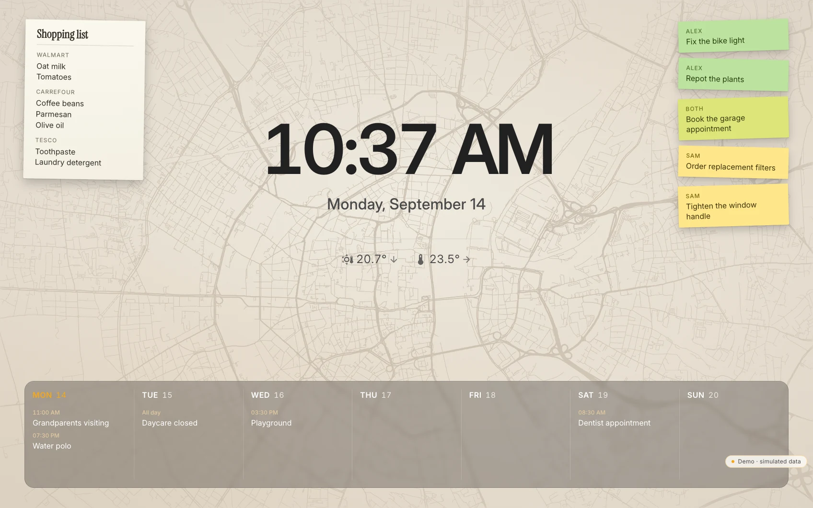

<div align="center">

<picture>
  <source media="(prefers-color-scheme: dark)" srcset="app/public/brand/hauser-logo-dark.svg">
  <source media="(prefers-color-scheme: light)" srcset="app/public/brand/hauser-logo-light.svg">
  
</picture>

**A calm, visual Home Assistant frontend for the people who live in the home.**

[**Try the live demo**](https://ralleur.github.io/hauser/demo/) · [Install](#installation) · [Documentation](#documentation-and-troubleshooting) · [Roadmap](ROADMAP.md)

</div>

Hauser is a self-hosted, room-first Home Assistant dashboard for wall panels,
tablets and phones. Home Assistant remains the operator and admin interface;
Hauser is the calm everyday interface for family members and the rest of the
household.



The ambient lock screen is the default resting state: useful from across the
room, quiet until touched, and a direct path into the relevant household view.

---

## Beta status

Hauser is an **installable, self-hosted smart home interface in its first public
technical beta**. It is an MIT-licensed hobby project, not a commercial service
and not a promise of support.

The portable product deliberately excludes the author's private code-modifying
AI agent. That workflow depends on a trusted development checkout, commit/push
rights and host deployment tooling; granting a read-only Docker installation
those capabilities would violate the product's security and persistence model.
This boundary does not apply to bounded, non-code-modifying AI functions.

The current branch contains a source-built Docker Compose installation,
versioned external household configuration, a deterministic setup wizard,
automatic configuration migration, persistent volumes, backup/restore and a
documented rollback path. The isolated clean-room pilot has completed setup,
control/state echo, reconnect and persistence without source changes.

`v0.4.0-beta.1` was the first public release. Its versioned GHCR image is the
normal installation path; `v0.4.0-beta.5` is current. A real installation by an
external person in a second household remains mandatory during beta
stabilisation, before the release candidate — see [the roadmap](ROADMAP.md).

The hosted static demo runs the real interface against simulated devices. It
never connects to a visitor's Home Assistant or to the maintainer's private
services.

---

## Why it exists

Home Assistant is an excellent automation engine. Its dashboard is a grid you
fill with cards, each written by a different author, each with its own spacing,
motion, and idea of what a button feels like. It works, and it never quite
feels like one product.

Hauser takes the other path:

- **One design system.** Every surface comes from the same tokens, type scale
  and motion spec — see [`design-tokens/`](design-tokens/) and
  [`docs/01-design-system.md`](docs/01-design-system.md).
- **Optimistic UI.** Tap a light and it turns on immediately; the command
  travels afterwards. When the house disagrees, the control animates back to
  the truth instead of quietly lying. See
  [`docs/02-interaction-contract.md`](docs/02-interaction-contract.md).
- **A performance budget treated as a requirement.** Under 16 ms from touch to
  visible feedback, transform and opacity only, no layout thrash. See
  [`docs/03-performance-budget.md`](docs/03-performance-budget.md).
- **Backends without visible seams.** Home Assistant, Jellyfin, calendar data,
  shared household data and the optional Paperless bridge keep their own
  transport boundaries while the interface presents one design system.

The public documentation describes the architecture that is active now. It
deliberately omits superseded plans and rejected alternatives.

## What it does

| Area | |
|---|---|
| **Rooms** | Climate, lights, scenes, presence and window state; each room illustrated in three lighting states that follow the actual lights |
| **Home Assistant** | WebSocket via the official client, optimistic commands with reconciliation, reconnect handling, day/night theming from `sun.sun` |
| **Media** | Jellyfin library, shelves, detail view, HLS playback with resume; room audio through HA media players |
| **Energy** | Live load and daily consumption from real power sensors, with honest empty states for figures the house cannot measure |
| **Everyday** | Calendar, notes, reminders, shopping list, laundry notifications |
| **Documents** | PIN-gated Paperless-ngx search, preview, download and import through the optional companion server |
| **Devices** | Add, hide, rename, assign to a room and reorder entities from inside the UI |
| **Two shells** | A landscape wall panel and a one-handed phone layout, sharing one design system |

### Integration status

This distinction matters because the static demo, an implemented adapter and a
configured live service are not the same thing:

| Integration | Repository implementation | Static beta demo |
|---|---|---|
| **Home Assistant** | Implemented. The official WebSocket client supplies entity state, commands, reconciliation and reconnects. | Simulated entities; no connection to a live HA instance. |
| **Jellyfin** | Implemented. A dedicated REST client handles authentication, shelves, browse and detail data; playback uses PlaybackInfo, HLS and progress reporting. | Curated simulated library data; no connection to a live Jellyfin server. |
| **Calendar** | Implemented through Home Assistant, not as a separate calendar backend. Hauser discovers `calendar.*` entities and reads events with HA's `calendar/list` WebSocket command. The settings UI can also start HA's iCloud/CalDAV config flow. | Curated simulated events. |
| **Reminders** | Implemented by the optional companion server as central household data. Selected HA `todo.*` lists can additionally be merged through WebSocket. | Curated simulated data. |
| **Shopping** | A local server-side bridge keeps the HMI and a shared Notion shopping page in sync without exposing the Notion token to the browser. | Curated simulated data; no Notion connection. |
| **Paperless-ngx** | Implemented by the optional companion server. It keeps the Paperless token and PIN server-side and exposes only gated search, processing status, preview/download and import operations. | Deliberately omitted; private documents do not belong in a public static demo. |
| **Notion** | Optional private integration for the shared shopping list only. Reminders do not depend on Notion. | Not connected; shopping uses fixtures. |

## Screenshots

| | |
|---|---|
|  |  |
| **Home** — compact controls leave the room illustration visible | **Everyday** — shopping and reminders without a second app |
|  |  |
| **Library** — Jellyfin, in the same design system | **Energy** — real sensors, honest gaps |

## Architecture

```
Wall panel (Android tablet, kiosk mode)
        │
   Hauser PWA  ← this repository
        │
   ┌────┴──────────────┬──────────────────────┐
   ▼                   ▼                      ▼
HA WebSocket     Jellyfin REST + HLS    Optional companion
devices, energy,                       shared household data
calendar.*, todo.*                     + PIN-gated Paperless
```

The app is Svelte 5 + Vite, with a four-layer adapter between the UI and the
backends: an entity store holding server truth, an overlay of pending intents, a
command queue, and a swappable backend. The UI only ever reads `merged()` and
writes `dispatch()`. That seam is what makes both the optimistic behaviour and
the offline demo possible.

An optional companion server (`app/server.mjs`) adds centrally stored reminders,
the same-origin proxy for the local Notion shopping bridge, and the PIN-gated
Paperless-ngx bridge. Integration credentials stay server-side and are never
shipped to the browser. The core —
rooms, lights, climate, calendar, media and energy — runs without the companion.
The public demo has no Notion dependency.

## Install with Docker Compose

The release Compose file pulls the versioned public image and starts it with
persistent config, data and asset volumes:

```bash
cp .env.example .env
docker compose pull
docker compose up -d
docker compose ps
docker compose exec hauser node container/healthcheck.mjs
```

The image `ghcr.io/ralleur/hauser:v0.4.0-beta.5` is published only after the
matching public beta tag passes the release workflow. Tagged releases also
publish the plain `0.4.0-beta.5` tag, which the Home Assistant Supervisor
resolves from the App manifest. When deliberately building
from a checkout instead, use the explicit source-build overlay:

```bash
docker compose -f compose.yaml -f compose.build.yaml up -d --build
```

Open <http://localhost:4173>. The default bind is loopback-only; LAN exposure
must be enabled deliberately in `.env`. The complete installation, health,
backup, restore, update and rollback contract is documented in
[`docs/08-installation.md`](docs/08-installation.md).

On first start, the setup wizard guides you through:

1. choosing the interface language;
2. testing the Home Assistant URL and long-lived access token;
3. discovering Areas and relevant entities;
4. reviewing, renaming and ordering Hauser rooms and assigning devices;
5. enabling or skipping Jellyfin;
6. validating and atomically activating the configuration.

No source edit is required. Later changes are available directly under
**System → Home → Rooms & devices**. Home Assistant Areas are only read as input;
Hauser does not rename or delete them.

A clean checkout can also produce a commit-bound local image with
`./scripts/build-image.sh`; set its reported repository and tag in `.env` before
starting Compose. The release workflow publishes only after an explicit version
tag whose value matches `package.json`.

## Running the developer build

```bash
cd app
npm install
npm run dev
```

That starts against a fake backend with simulated devices, which is the fastest
way to look around.

For the complete installation and first-run flow, use the isolated development
pilot instead. It starts a synthetic Home Assistant and a fresh Hauser instance
with separate containers, credentials and volumes:

```bash
./scripts/dev-pilot.sh up
```

See [`docs/09-dev-pilot.md`](docs/09-dev-pilot.md) for onboarding, persistence,
reset and isolation details.

Run the publication-gate test suite with:

```bash
cd app
npm test
```

### Advanced configuration

The wizard writes a human-readable, versioned household configuration. Advanced
users can inspect the neutral examples in [`app/config/examples/`](app/config/examples/)
and the full contract in [`docs/07-configuration.md`](docs/07-configuration.md).
Invalid or partial input fails closed instead of silently loading another
household. Manual editing is optional, not part of the normal install path.

The published release package will use a versioned GHCR image. The source-built
Compose overlay remains available for development and source-level verification;
after publication it is not the normal public installation path.

### Building the demo

```bash
cd app
npm run build:demo
```

Produces a fully static bundle in `app/dist-demo/` with a simulated backend, no
companion server, and a permanent "demo" badge. The hosted demo publishes the
same artifact type below the repository's Pages base path.

## Documentation

| | |
|---|---|
| [`docs/00-architecture.md`](docs/00-architecture.md) | Current system architecture and boundaries |
| [`docs/01-design-system.md`](docs/01-design-system.md) | Tokens, palette, typography, motion |
| [`docs/02-interaction-contract.md`](docs/02-interaction-contract.md) | Optimistic UI and reconciliation rules |
| [`docs/03-performance-budget.md`](docs/03-performance-budget.md) | The numbers, and how they are enforced |
| [`docs/04-integrations.md`](docs/04-integrations.md) | Implemented service paths and demo boundaries |
| [`docs/05-screens-and-flows.md`](docs/05-screens-and-flows.md) | Current panel and phone navigation model |
| [`docs/06-component-catalog.md`](docs/06-component-catalog.md) | Component inventory |
| [`docs/07-configuration.md`](docs/07-configuration.md) | Versioned household configuration contract and failure modes |
| [`docs/08-installation.md`](docs/08-installation.md) | Container/Compose installation, persistence, health, backup and rollback |
| [`docs/09-dev-pilot.md`](docs/09-dev-pilot.md) | Isolated synthetic Home Assistant and repeatable onboarding environment |
| [`CHANGELOG.md`](CHANGELOG.md) | User-visible release history and known limitations |
| [`docs/release-notes-template.md`](docs/release-notes-template.md) | Required evidence and identity contract for each release |

The interface speaks German, English, French, Italian, Portuguese and Polish,
and follows the browser language unless you pick one in the settings. Dates,
times and numbers follow the chosen language too.

All repository documentation intended for users and contributors is in English.

## Status and expectations

Hauser is pre-release beta-stage software. The design system, Home Assistant and
Jellyfin adapters, deterministic onboarding, HA-backed calendar path, optional Paperless
bridge, companion-backed household data, panel shell and phone shell are
implemented. `v0.4.0-beta.1` was the first public beta; the repository,
documentation, image and static demo move as one release line.

This is a hobby project maintained by one person. There is no SLA and response
times remain unpredictable, but focused bug fixes, installation evidence,
documentation, translations, accessibility improvements and small pull requests
are explicitly welcome. See [CONTRIBUTING.md](CONTRIBUTING.md) and
[ROADMAP.md](ROADMAP.md).

## License

Source code, tests, scripts, configuration examples, design tokens and technical
documentation are licensed under the [MIT license](LICENSE). Original room
illustrations, background artwork and public screenshots are licensed
[CC BY 4.0](ASSETS-LICENSE.md).

The Hauser name, logos, brand marks, official application icons and favicon are
not licensed under MIT or CC BY. See the [brand and trademark policy](TRADEMARKS.md).
Fonts, Material Design Icons and other third-party components remain under their
own terms and are listed in [NOTICE](NOTICE).

Not affiliated with Home Assistant or Jellyfin.
