<div align="center">

<picture>
  <source media="(prefers-color-scheme: dark)" srcset="app/public/brand/hauser-logo-dark.svg">
  <source media="(prefers-color-scheme: light)" srcset="app/public/brand/hauser-logo-light.svg">
  
</picture>

**A calm, room-first Home Assistant frontend for the people who live in the home.**

[**Project page**](https://ralleur.github.io/hauser/) · [**Live demo**](https://ralleur.github.io/hauser/demo/) · [What's new](#whats-new) · [Install](#installation) · [Documentation](#documentation) · [Roadmap](ROADMAP.md)

[](https://github.com/ralleur/hauser/releases)
[](https://github.com/ralleur/hauser/actions/workflows/quality-and-release.yml)
[](LICENSE)
[](#as-a-home-assistant-app)

</div>

Hauser is a self-hosted dashboard for wall panels, tablets and phones. Home
Assistant stays the operator and admin interface; Hauser is the everyday
interface for family members and the rest of the household: one design system,
optimistic controls, a room illustration that follows the actual lights, and a
standby screen that is useful from across the room.

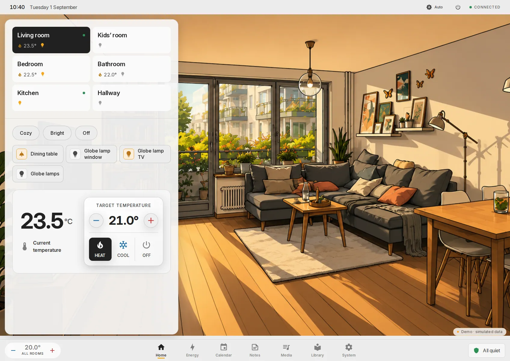

Every image on this page is a capture from the [public demo](https://ralleur.github.io/hauser/demo/),
which runs the real interface against simulated devices. It never connects to a
visitor's Home Assistant or to the maintainer's private services.

> **Beta.** Hauser installs and runs today (`v0.6.2`), but it is a one-person
> hobby project in its first public technical beta: no SLA, fast-moving
> versions, and device coverage that still grows release by release. Details in
> [Status and expectations](#status-and-expectations).

## Contents

- [What's new](#whats-new)
- [Why it exists](#why-it-exists)
- [What it does](#what-it-does)
- [Screenshots](#screenshots)
- [How it feels](#how-it-feels)
- [Integration status](#integration-status)
- [Architecture](#architecture)
- [Installation](#installation)
- [Development](#development)
- [Documentation](#documentation)
- [Status and expectations](#status-and-expectations)
- [Contributing](#contributing)
- [License](#license)

## What's new

The last seven releases (0.5.0 → 0.6.2, 27 August to 1 September 2026) rebuilt
most of what is on screen. The [project page](https://ralleur.github.io/hauser/#whats-new)
shows each of them with a capture; the [changelog](CHANGELOG.md) has the full
record.

| Version | Highlights |
|---|---|
| **0.6.2** | The Home Assistant App no longer sticks on "Connecting…" when Core bundles messages. |
| **0.6.1** | A subtle street map of your town behind the standby clock, with place search. Noticeably faster start. Phone room images at a fifth of their size; offline cache 17 → 3.5 MB. Updates are offered, not forced. Settings regrouped into *Interface & controls* and *Experimental*. |
| **0.6.0** | As a Home Assistant App there is no address and no token to type. Setup ends with the address phones use, with a copy action and a QR code. |
| **0.5.3** | One climate control sets every thermostat; clearer, more compact climate on phones. |
| **0.5.2** | Camera feeds become movable pop-outs; one to four room tiles per row; the home layout is a live drawer. |
| **0.5.1** | Scenes per room with an editor that previews on the real lights; the active scene is highlighted; the room editor opens on a quick-setup grid. |
| **0.5.0** | *Rooms & devices* is a real room list; tapping a room's image opens the image editor; version numbers drop the `-beta.N` suffix. |

## Why it exists

Home Assistant is an excellent automation engine. Its dashboard is a grid you
fill with cards, each written by a different author, each with its own spacing,
motion, and idea of what a button feels like. It works, and it never quite
feels like one product.

Hauser takes the other path:

- **One design system.** Every surface comes from the same tokens, type scale
  and motion spec — see [`design-tokens/`](design-tokens/) and
  [`docs/01-design-system.md`](docs/01-design-system.md).
- **Optimistic UI.** Tap a light and it turns on immediately; the command
  travels afterwards. When the house disagrees, the control animates back to
  the truth instead of quietly lying. See
  [`docs/02-interaction-contract.md`](docs/02-interaction-contract.md).
- **A performance budget treated as a requirement.** Under 16 ms from touch to
  visible feedback, transform and opacity only, no layout thrash. See
  [`docs/03-performance-budget.md`](docs/03-performance-budget.md).
- **Backends without visible seams.** Home Assistant, Jellyfin, calendar data,
  shared household data and the optional Paperless bridge keep their own
  transport boundaries while the interface presents one design system.

The public documentation describes the architecture that is active now. It
deliberately omits superseded plans and rejected alternatives.

## What it does

| Area | |
|---|---|
| **Rooms** | Climate, lights, scenes, presence and window state; each room illustrated in three lighting states that follow the actual lights |
| **Scenes** | Three built-in scenes per room plus your own; an editor that previews every change on the real lights and takes it back when it closes |
| **Home Assistant** | WebSocket via the official client, optimistic commands with reconciliation, reconnect handling, day/night theming from `sun.sun` |
| **Climate** | A thermostat card per room and one shared control for every thermostat in the status bar and the phone's quick actions |
| **Media** | Jellyfin library, shelves, detail view, HLS playback with resume; room audio through HA media players; camera feeds as movable pop-outs |
| **Energy** | Live load and daily consumption from real power sensors, with honest empty states for figures the house cannot measure |
| **Everyday** | Calendar, notes, reminders as post-its per person, shopping list grouped by shop, laundry notifications |
| **Documents** | PIN-gated Paperless-ngx search, preview, download and import through the optional companion server |
| **Room images** | An assistant that turns a phone photograph of your room into the three lighting states, an image-set library, and manual upload ([details](#room-images)) |
| **Devices** | Add, hide, rename, assign to a room and reorder entities from inside the UI; unfinished room edits survive a detour to another settings section |
| **Standby** | A calm lockscreen with clock, week strip, notes and shopping list; optionally a faint street map of your own town, rendered once on the server from OpenStreetMap data ([details](docs/07-configuration.md#standby-city-map)) |
| **Two shells** | A landscape wall panel and a one-handed phone layout, sharing one design system |
| **Hotel mode** | Optional, off by default: turns a dedicated panel into a guest surface for one holiday apartment — stays from a Home Assistant calendar, a default-deny device release, a PIN-gated admin session and a guest checkout ([details](docs/07-configuration.md#hotel-mode-holiday-apartment)) |

The interface speaks German, English, French, Italian, Portuguese and Polish,
follows the browser language unless you pick one in the settings, and formats
dates, times and numbers for the chosen language.

## Screenshots

Panel captures are 1696 × 1200 CSS pixels, the panel's reference viewport;
phone captures are 390 × 844 at 2×. All of them come from the demo build.

| | |
|---|---|
| 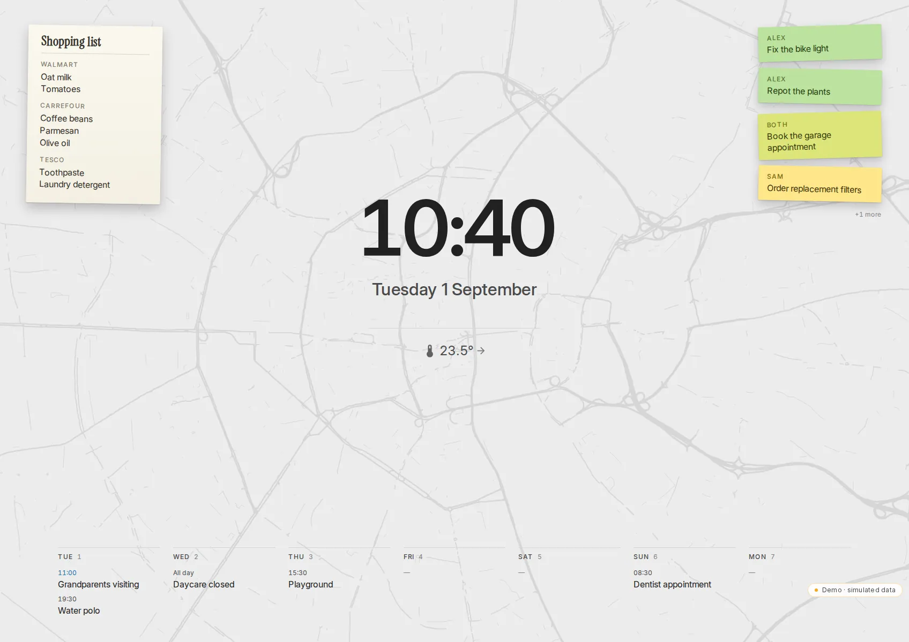 | 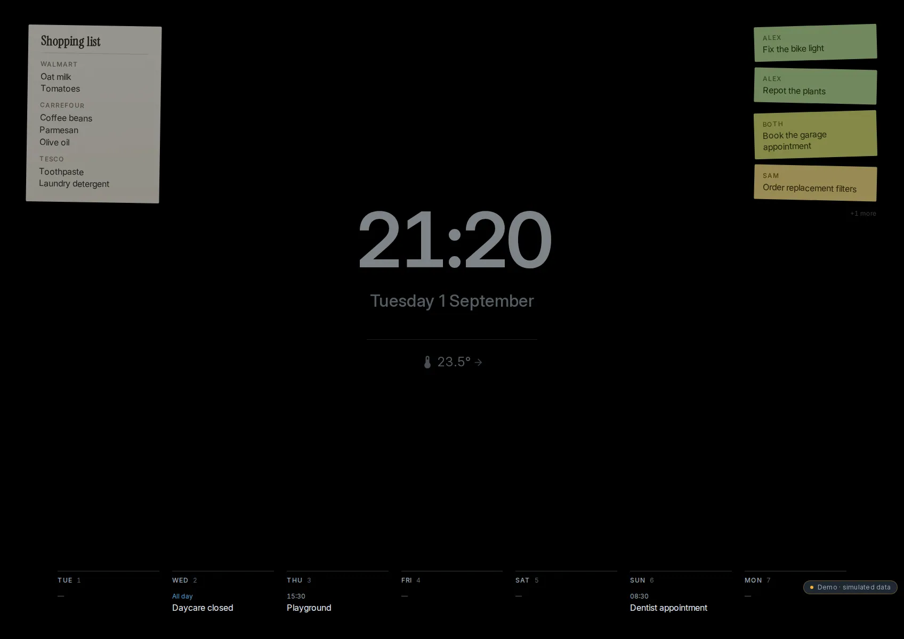 |
| **Standby, day** — the lists are already there; touch one and you are in it | **Standby, evening** — same layout, dimmed; after 22:00 only the time remains |
| 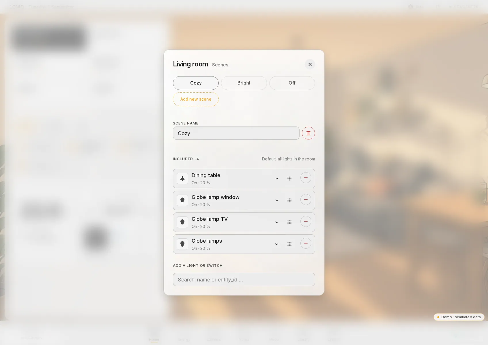 | 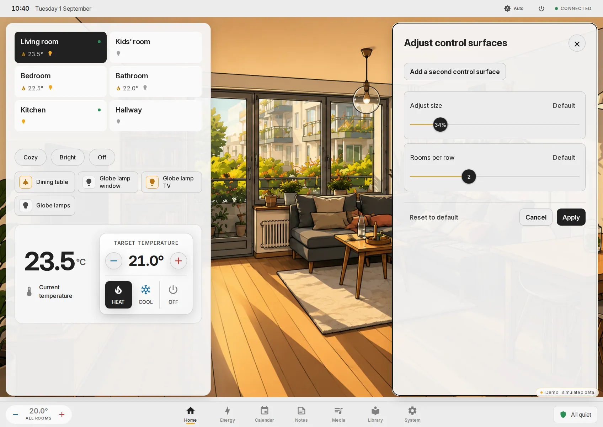 |
| **Scenes** — long-press a chip, edit the scene with a live preview | **Layout** — long-press the room background, adjust the panel in place |
| 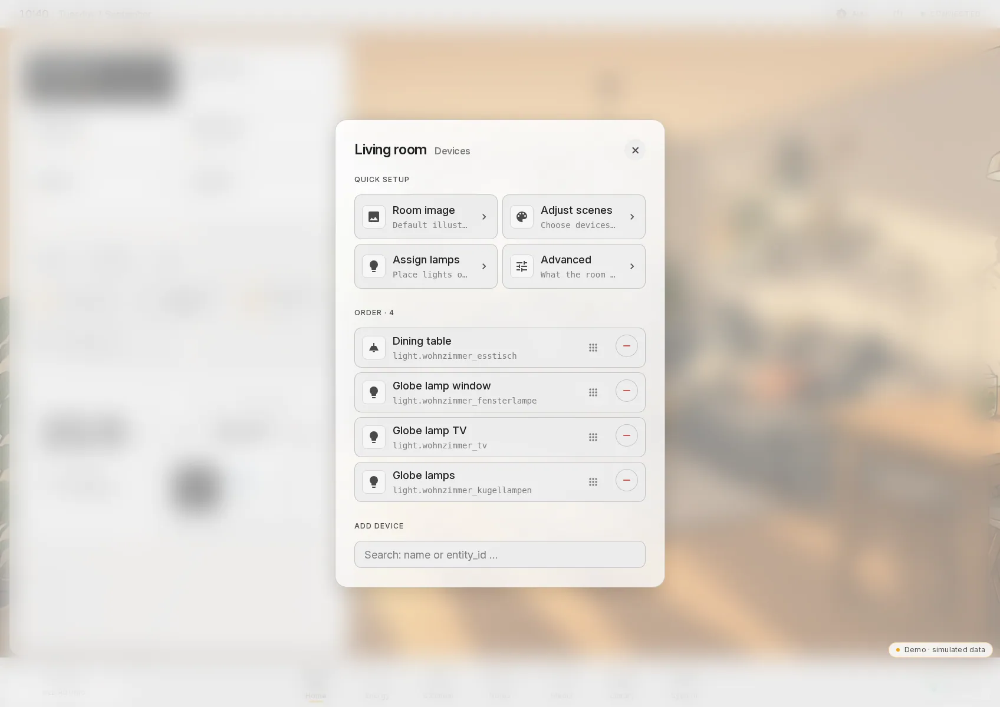 | 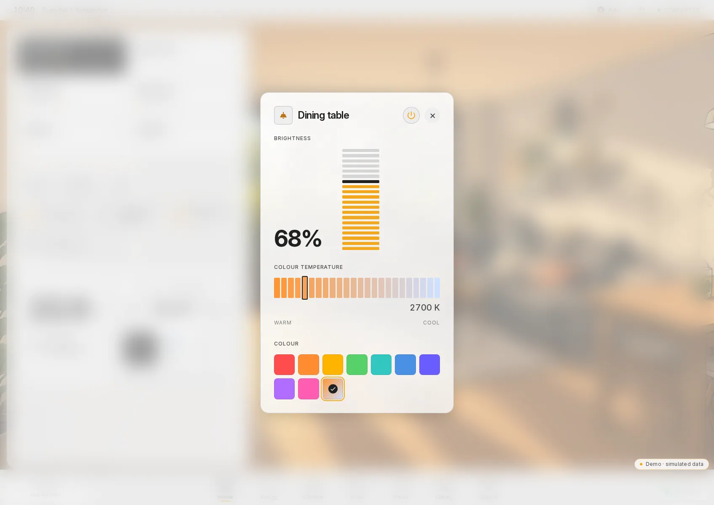 |
| **Room editor** — four tiles, then the device list with drag handles | **Lamp detail** — only what the lamp actually supports |
| 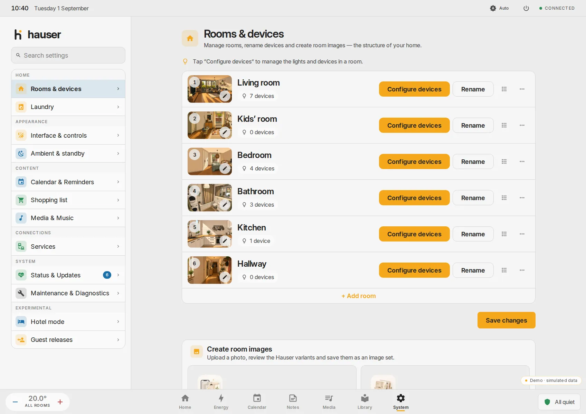 | 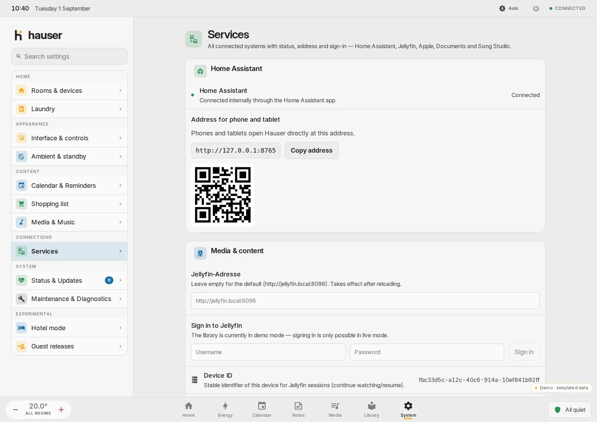 |
| **Settings** — six groups and a search box | **Services** — the address your phone needs, as text and QR |
| 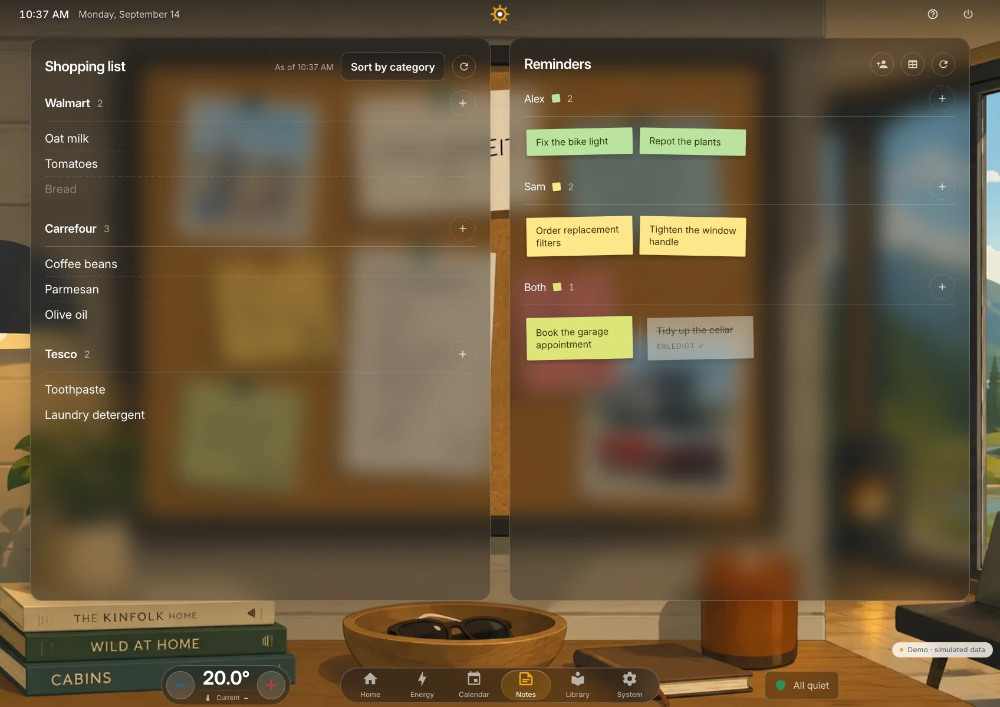 | 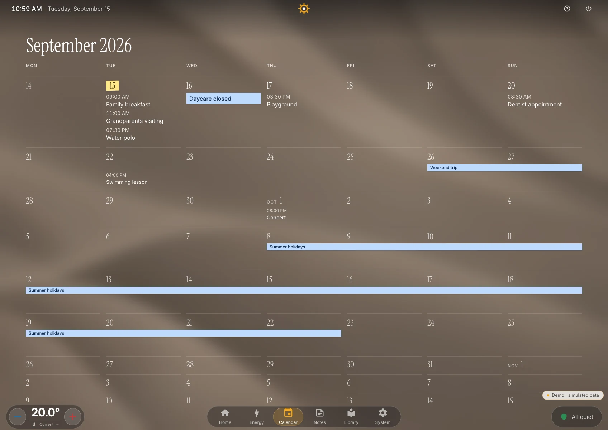 |
| **Everyday** — shopping and reminders without a second app | **Calendar** — every `calendar.*` entity you select, in one grid |
| 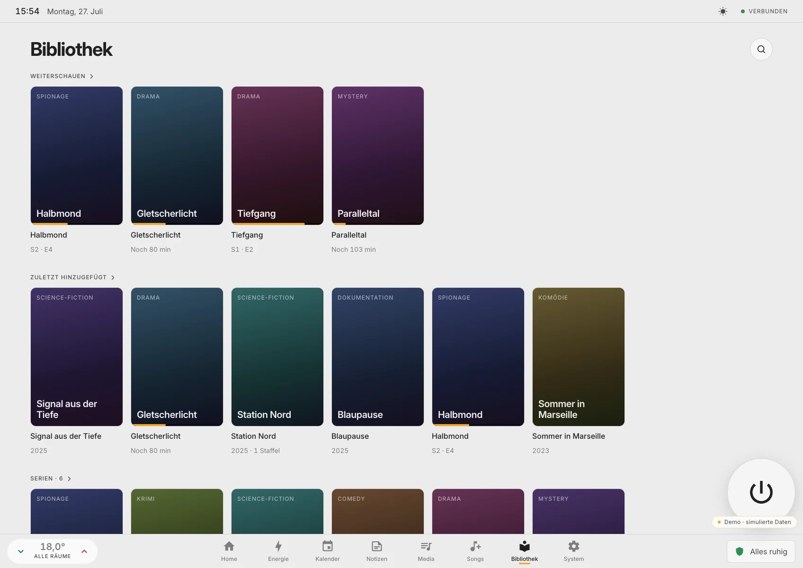 | 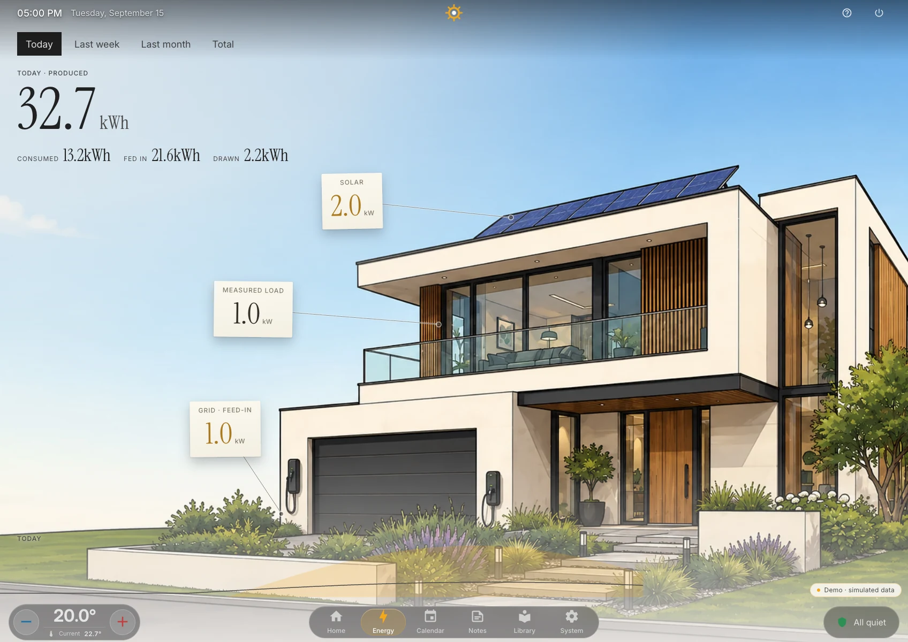 |
| **Library** — Jellyfin, in the same design system; the sixteen titles and their posters are the demo's own inventions | **Energy** — real sensors, honest gaps |

<p align="center">
  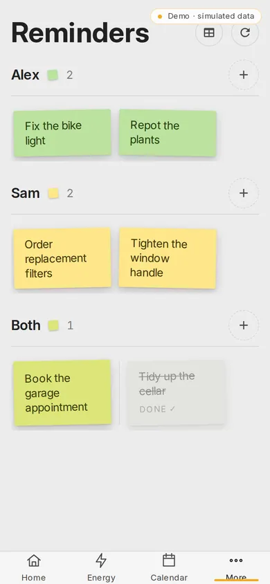&nbsp;&nbsp;
  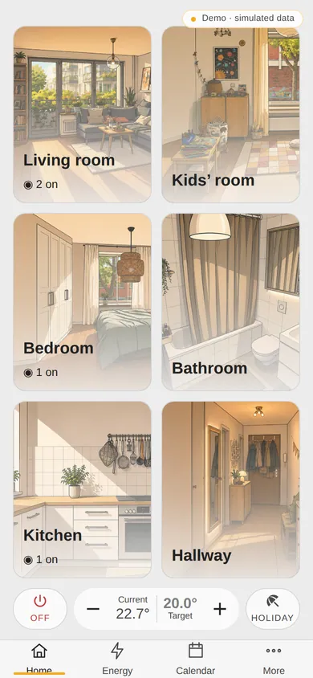&nbsp;&nbsp;
  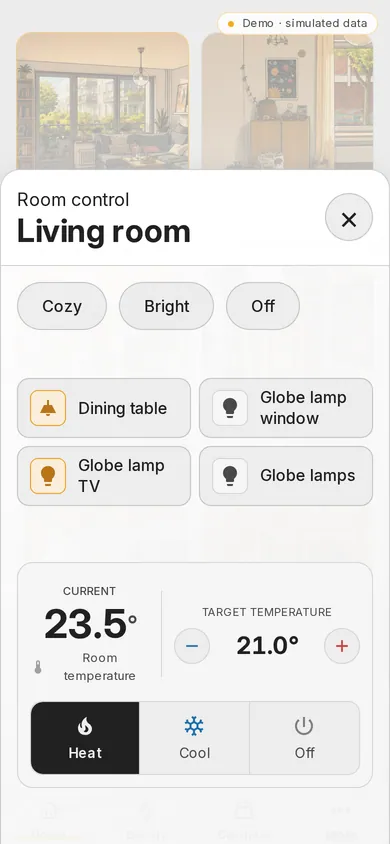
</p>

<p align="center"><sub><b>Phone shell</b> — reminders, the home feed and a room sheet. Navigation moves to the thumb; the tokens, motion and interaction rules stay identical.</sub></p>

## How it feels

**Tap does the everyday thing; hold opens the editor for that thing.** There is
no edit mode and no gear icon in the corner. A tap on a lamp toggles it; a
long press (400 ms, cancelled by more than 10 px of movement) opens brightness,
colour temperature and colour. The same rule applies to a scene chip (apply /
edit the scene), a room tile (select / edit the room), the room background
(nothing / the layout drawer) and the standby button (rest / choose where the
button lives). The [project page](https://ralleur.github.io/hauser/#press)
lets you try each spot.

**The interface answers before the house does.** Every intent is applied to the
screen immediately, dispatched, tracked, reconciled against the incoming state
and abandoned after a timeout. When Home Assistant confirms, nothing visible
happens, because the interface was already right; when it disagrees, the
control animates back to the truth. The contract is written down in
[`docs/02-interaction-contract.md`](docs/02-interaction-contract.md).

**The panel follows the sun.** Day and night are one layout with different
surfaces, and the room illustration is lit by the lamps that are actually on.
Nobody in the household ever reaches for a theme setting; a fixed appearance is
available for those who want one.

### Room images

Every room carries an illustration of itself in three lighting states. The ones
that ship are of the maintainer's house, which is no use to yours, so the
room-image assistant makes yours from a phone photograph: one moderate
perspective correction, then style only, so what comes back is still your room.
Day, evening and lights-off are generated as one set, reviewed together and
published atomically to the image-set library. This is the one place where
Hauser talks to a paid third party: the assistant needs your own OpenAI access,
says so before anything is uploaded, confirms every paid step by hand and keeps
a running count of provider calls on screen. Uploading your own pictures or
keeping the bundled illustration needs no account at all.

## Integration status

The static demo, an implemented adapter and a configured live service are not
the same thing:

| Integration | Repository implementation | Static beta demo |
|---|---|---|
| **Home Assistant** | Implemented. The official WebSocket client supplies entity state, commands, reconciliation and reconnects. As a Home Assistant App the server talks to Core over the Supervisor; the browser reaches live state through a same-origin WebSocket. | Simulated entities; no connection to a live HA instance. |
| **Jellyfin** | Implemented. A dedicated REST client handles authentication, shelves, browse and detail data; playback uses PlaybackInfo, HLS and progress reporting. | Curated simulated library data; no connection to a live Jellyfin server. |
| **Calendar** | Implemented through Home Assistant, not as a separate calendar backend. Hauser discovers `calendar.*` entities and reads events with HA's `calendar/list` WebSocket command. The settings UI can also start HA's iCloud/CalDAV config flow. | Curated simulated events. |
| **Reminders** | Implemented by the optional companion server as central household data. Selected HA `todo.*` lists can additionally be merged through WebSocket. | Curated simulated data. |
| **Shopping** | A local server-side bridge keeps the HMI and a shared Notion shopping page in sync without exposing the Notion token to the browser. | Curated simulated data; no Notion connection. |
| **Paperless-ngx** | Implemented by the optional companion server. It keeps the Paperless token and PIN server-side and exposes only gated search, processing status, preview/download and import operations. | Deliberately omitted; private documents do not belong in a public static demo. |
| **OpenStreetMap / Overpass** | Optional and off by default. When a location is configured, the server queries a public Overpass endpoint once and renders a monochrome road SVG for the standby background. Map data © OpenStreetMap contributors, ODbL. | Not connected. The demo ships one pre-rendered sample map (Cologne, 5 km around the cathedral) so the standby background can be shown; place search returns fixed suggestions. |
| **OpenAI** | Optional, only for the room-image assistant, with the user's own access. | The assistant runs on prepared sample photographs; no account and no AI service is involved. |
| **Notion** | Optional private integration for the shared shopping list only. Reminders do not depend on Notion. | Not connected; shopping uses fixtures. |

## Architecture

```
Wall panel (Android tablet, kiosk mode)      Phone (PWA, one-handed shell)
        │                                            │
        └──────────────────┬─────────────────────────┘
                      Hauser PWA  ← this repository
                           │
        ┌──────────────────┼──────────────────────┐
        ▼                  ▼                       ▼
  HA WebSocket       Jellyfin REST + HLS     Optional companion (app/server.mjs)
  devices, energy,                            shared household data, Notion bridge,
  calendar.*, todo.*                          PIN-gated Paperless, room-image jobs,
                                              standby map rendering
```

The app is Svelte 5 + Vite, with a four-layer adapter between the UI and the
backends: an entity store holding server truth, an overlay of pending intents, a
command queue, and a swappable backend. The UI only ever reads `merged()` and
writes `dispatch()`. That seam is what makes both the optimistic behaviour and
the offline demo possible.

The companion server adds centrally stored reminders, the same-origin proxy for
the local Notion shopping bridge, the PIN-gated Paperless-ngx bridge, the
room-image jobs and the standby map. Integration credentials stay server-side
and are never shipped to the browser. The core — rooms, lights, climate,
calendar, media and energy — runs without the companion.

## Installation

Two supported paths, both ending in the same guided setup wizard. On Home
Assistant OS and Supervised installations the packaged App is the short one;
Home Assistant Container, plain Docker hosts and NAS systems use Docker Compose.

### As a Home Assistant App

[](https://my.home-assistant.io/redirect/supervisor_add_addon_repository/?repository_url=https%3A%2F%2Fgithub.com%2Fralleur%2Fhauser)

1. Use the button above, or open **Settings → Apps → App Store → Repositories**
   and add `https://github.com/ralleur/hauser` by hand.
2. Select **Hauser**, choose **Install**, then **Start**.
3. Choose **Open Web UI** and run the setup wizard.

The App connects to Home Assistant itself: it declares `homeassistant_api`, and
the Hauser server talks to Home Assistant Core over the internal Supervisor
endpoints. There is no field for a Home Assistant URL and no Long-Lived Access
Token; neither is stored in `/data` or handed to the browser. The wizard ends by
showing the exact address phones and tablets use, with a copy action and a QR
code, and that address stays available under **System → Services**.

The App is a thin packaging layer around the same multi-architecture image
(`aarch64`, `amd64`) and stores all state in Home Assistant's persistent `/data`
directory, so App backups cover the household configuration. It deliberately
uses a direct LAN port instead of Ingress, and that port carries no separate
login and no device pairing: every device that reaches it on the trusted network
can operate Hauser. Keep it on a trusted network and do not publish it to the
internet.

The manifest declares `stage: experimental`. On `v0.6.2` a fresh install,
start, credential-free setup discovery, activation, the internal Home Assistant
connection and opening the displayed address from a real phone were verified on
an isolated Home Assistant OS test system; real device commands with state echo,
reconnect after a restart and backup/restore last passed on an earlier version
and were not re-verified here. None of it has been tried across other people's
installations yet. [`hauser/DOCS.md`](hauser/DOCS.md) documents the packaging,
persistence, backup/restore and current limitations in full.

Apps require Home Assistant OS or a Supervised installation. Home Assistant
Container has no App system — use Compose below.

### With Docker Compose

The release Compose file pulls the versioned public image and starts it with
persistent config, data and asset volumes:

```bash
cp .env.example .env
docker compose pull
docker compose up -d
docker compose ps
docker compose exec hauser node container/healthcheck.mjs
```

Open <http://localhost:4173>. The default bind is loopback-only; LAN exposure
must be enabled deliberately in `.env`. The image `ghcr.io/ralleur/hauser:v0.6.2`
is published only after the matching public tag passes the release workflow;
tagged releases also publish the plain `0.6.2` tag, which the Home Assistant
Supervisor resolves from the App manifest. To build from a checkout instead,
use the explicit source-build overlay:

```bash
docker compose -f compose.yaml -f compose.build.yaml up -d --build
```

The complete installation, health, backup, restore, update and rollback
contract is in [`docs/08-installation.md`](docs/08-installation.md). This is
the path the first external installation confirmed: Docker Compose on an Asustor
NAS (Linux, x86_64) against Home Assistant Container, roughly eight areas and
370 entities discovered automatically, first light under control ten minutes in
([issue #7](https://github.com/ralleur/hauser/issues/7)).

### First run

On first start, the setup wizard guides you through:

1. choosing the interface language;
2. connecting to Home Assistant — as the Home Assistant App this is automatic
   and asks for nothing; with Docker Compose it tests the Home Assistant URL and
   long-lived access token you provide;
3. discovering Areas and relevant entities;
4. reviewing, renaming and ordering Hauser rooms and assigning devices;
5. enabling or skipping Jellyfin;
6. optionally placing the standby map — from Home Assistant's location, this
   device's location, a place search or coordinates;
7. validating and atomically activating the configuration.

No source edit is required. Later changes are made under
**System → Rooms & devices**. Home Assistant Areas are only read as input;
Hauser does not rename or delete them.

### Configuration

The wizard writes a human-readable, versioned household configuration. Advanced
users can inspect the neutral examples in
[`app/config/examples/`](app/config/examples/) and the full contract in
[`docs/07-configuration.md`](docs/07-configuration.md). Invalid or partial input
fails closed instead of silently loading another household. Manual editing is
optional, not part of the normal install path.

## Development

```bash
cd app
npm install
npm run dev          # fake backend with simulated devices — the fastest way to look around
npm test             # publication-gate test suite
npm run check        # svelte-check
npm run build        # production bundle
npm run build:demo   # the static demo, as published on the project page
```

`npm run build:demo` produces a fully static bundle in `app/dist-demo/` with a
simulated backend, no companion server and a permanent "demo" badge. The hosted
demo publishes the same artifact type below the repository's Pages base path;
`./scripts/build-pages.sh` assembles landing page and demo exactly as the Pages
workflow does.

For the complete installation and first-run flow, use the isolated development
pilot. It starts a synthetic Home Assistant and a fresh Hauser instance with
separate containers, credentials and volumes:

```bash
./scripts/dev-pilot.sh up
```

See [`docs/09-dev-pilot.md`](docs/09-dev-pilot.md) for onboarding, persistence,
reset and isolation details. A clean checkout can also produce a commit-bound
local image with `./scripts/build-image.sh`; set its reported repository and tag
in `.env` before starting Compose. The release workflow publishes only after an
explicit version tag whose value matches `package.json`.

## Documentation

| | |
|---|---|
| [`docs/00-architecture.md`](docs/00-architecture.md) | Current system architecture and boundaries |
| [`docs/01-design-system.md`](docs/01-design-system.md) | Tokens, palette, typography, motion |
| [`docs/02-interaction-contract.md`](docs/02-interaction-contract.md) | Optimistic UI and reconciliation rules |
| [`docs/03-performance-budget.md`](docs/03-performance-budget.md) | The numbers, and how they are enforced |
| [`docs/04-integrations.md`](docs/04-integrations.md) | Implemented service paths and demo boundaries |
| [`docs/05-screens-and-flows.md`](docs/05-screens-and-flows.md) | Current panel and phone navigation model |
| [`docs/06-component-catalog.md`](docs/06-component-catalog.md) | Component inventory |
| [`docs/07-configuration.md`](docs/07-configuration.md) | Versioned household configuration contract and failure modes |
| [`docs/08-installation.md`](docs/08-installation.md) | Container/Compose installation, persistence, health, backup and rollback |
| [`docs/09-dev-pilot.md`](docs/09-dev-pilot.md) | Isolated synthetic Home Assistant and repeatable onboarding environment |
| [`hauser/DOCS.md`](hauser/DOCS.md) | The Home Assistant App: packaging, persistence, backup and limitations |
| [`CHANGELOG.md`](CHANGELOG.md) | User-visible release history and known limitations |
| [`docs/release-notes-template.md`](docs/release-notes-template.md) | Required evidence and identity contract for each release |
| [`SECURITY.md`](SECURITY.md) | Trust boundaries and how to report a vulnerability |

All repository documentation intended for users and contributors is in English.

## Status and expectations

Hauser is pre-release, beta-stage software, maintained by one person as a hobby
project. `v0.4.0-beta.1` was the first public release; `v0.6.2` is current.
The repository, documentation, image and static demo move as one release line.

What is in place: a versioned GHCR image as the normal installation path, the
Home Assistant App packaging, a deterministic setup wizard with automatic
configuration migration, persistent volumes, backup/restore and a documented
rollback path. The isolated clean-room pilot has completed setup, control/state
echo, reconnect and persistence without source changes, and one external
household runs it in production.

What is still open: compatibility with the enormous range of Home Assistant
setups grows release by release (the first external report surfaced discovery
gaps for switches, media players and vacuums, fixed since, and real-hardware
vacuum confirmation is still outstanding); release-to-release upgrades across
other people's installations are part of beta stabilisation; there is no SLA
and no promised response time. Hauser is built for trusted deployments on your
own network, not for the public internet. See [ROADMAP.md](ROADMAP.md).

The portable product deliberately excludes the author's private code-modifying
AI agent. That workflow depends on a trusted development checkout, commit/push
rights and host deployment tooling; granting a read-only installation those
capabilities would violate the product's security and persistence model. This
boundary does not apply to bounded, non-code-modifying AI functions such as the
room-image assistant.

## Contributing

Focused bug fixes, installation evidence, documentation, translations,
accessibility improvements and small pull requests are explicitly welcome; open
a contribution proposal first for anything larger. See
[CONTRIBUTING.md](CONTRIBUTING.md) for the process, the pull-request
expectations and the six-language rule for UI text. Contributions are made
under the [Contributor License Agreement](CLA.md); you keep the copyright in
your work.

## License

Hauser is open source under `AGPL-3.0-only`: you can redistribute it and/or
modify it under the terms of version 3 of the GNU Affero General Public License
as published by the Free Software Foundation. See [LICENSE](LICENSE).

If you modify Hauser and let other people use it over a network, the AGPL asks
you to offer those users the source of your modified version. Running Hauser
unmodified in your own home creates no obligation at all.

### Licensing history

Hauser was MIT licensed up to and including **v0.4.0-beta.6**. Those releases
stay MIT and can be used and forked under those terms forever — the change to
the AGPL applies to later versions only. Nothing has been withdrawn or retagged.
Release `v0.4.0-beta.7` was published as `AGPL-3.0-or-later`; from
`v0.4.0-beta.8` onwards the project is `AGPL-3.0-only`.

Original room illustrations, background artwork and public screenshots are
licensed [CC BY 4.0](ASSETS-LICENSE.md). The Hauser name, logos, brand marks,
official application icons and favicon are not licensed under AGPL or CC BY.
See the [brand and trademark policy](TRADEMARKS.md). Fonts, Material Design
Icons and other third-party components remain under their own terms and are
listed in [NOTICE](NOTICE). Map data in the standby background © OpenStreetMap
contributors, ODbL.

Not affiliated with Home Assistant or Jellyfin.
