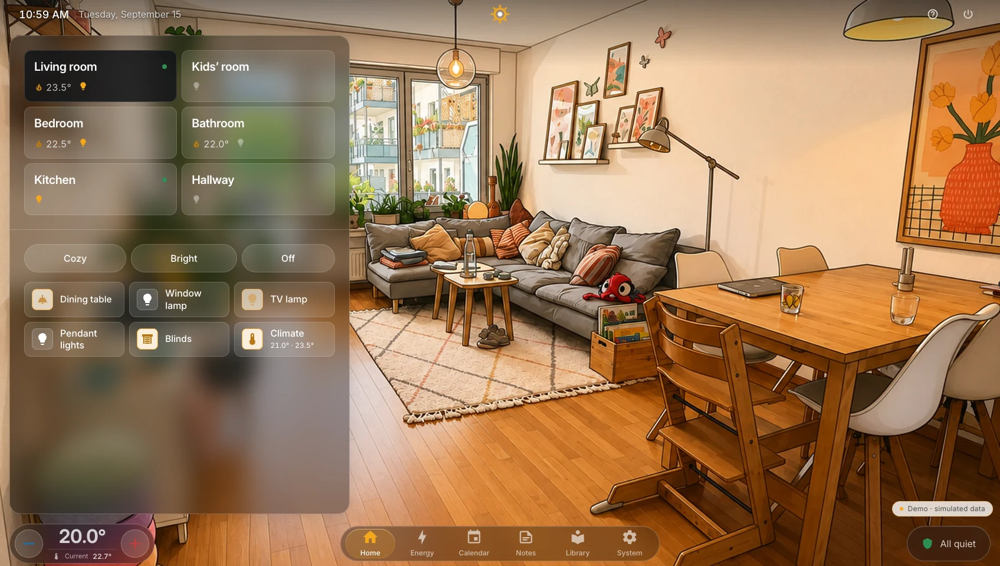
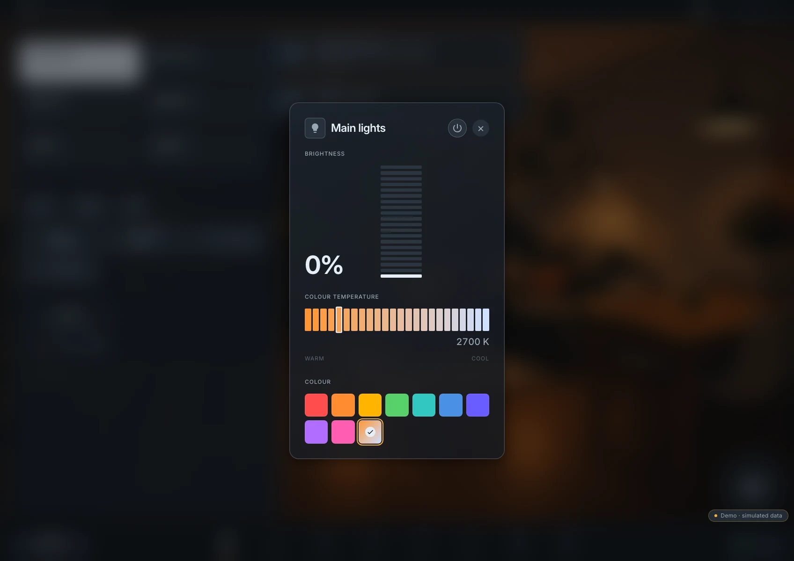
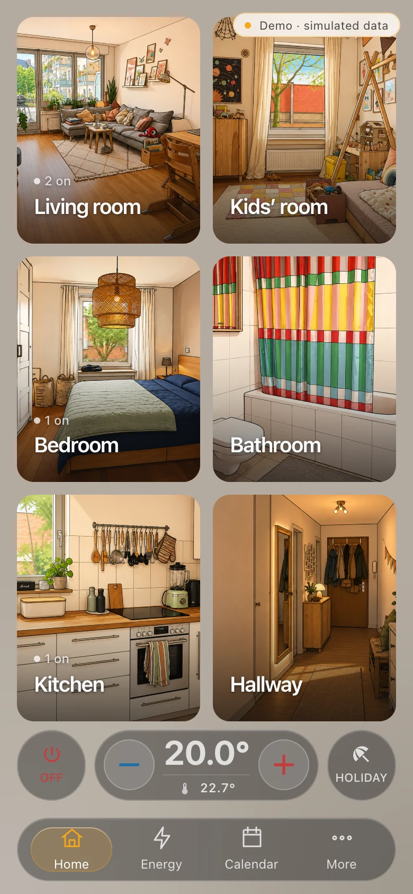

<div align="center">

<picture>
  <source media="(prefers-color-scheme: dark)" srcset="app/public/brand/hauser-logo-dark.svg">
  <source media="(prefers-color-scheme: light)" srcset="app/public/brand/hauser-logo-light.svg">
  
</picture>

**A calm, visual Home Assistant frontend for the people who live in the home.**

[**Try the live demo**](https://ralleur.github.io/hauser/demo/) · [Install](#installation) · [Documentation](#documentation-and-troubleshooting) · [Roadmap](ROADMAP.md)

</div>

## What is Hauser?

Hauser is a self-hosted Home Assistant frontend and household dashboard. It
prioritises a coherent visual language, room context and immediate feedback over
maximum technical information density. The goal is a screen that feels calm and
obvious to everyone in the home—not a wall of unrelated cards.

It runs as a landscape wall-panel interface and as a compact phone layout. Home
Assistant remains the automation engine and source of device truth.

That split is deliberate. A smart home needs an **operator cockpit** for the
person who builds it—dense diagnostics, configuration and technical detail—and a
**household surface** for the people who simply live with it. Trying to make one
permanent overview serve both jobs usually makes it worse at both.

Hauser focuses on the household surface. It trades maximum information density
for visual hierarchy, recognisable rooms and controls that invite use. Empty
space is functional here, not wasted capacity. Home Assistant remains the deeper
operator interface, while technical detail in Hauser stays behind deliberate
interactions instead of filling every everyday screen.

## What does it look like?

[](https://ralleur.github.io/hauser/demo/)

*The room dashboard is the primary experience: the current room stays visually
present while its devices and climate controls remain close at hand.*

| Lighting control | Phone layout |
|---|---|
|  |  |
| Direct controls use optimistic feedback and reconcile with Home Assistant state. | The same rooms and interaction language adapt to a one-handed viewport. |

## Live demo

**[Open the public Hauser demo →](https://ralleur.github.io/hauser/demo/)**

The demo is the real static beta interface running against representative
simulated devices. It does not connect to the maintainer's Home Assistant,
Jellyfin or household services, and it needs no installation. Try room
navigation, light controls, climate state, the phone-sized layout and the other
included screens directly in the browser.

## Release scope for `v0.4.0-beta.3`

`0.4.0-beta.3` is the current public beta. Its Home Assistant App package and
the `0.4.0-beta.3` / `v0.4.0-beta.3` multi-architecture image tags are published
from the same release build.

- **Room-first dashboard:** illustrated rooms, climate, lights, presence and
  window state in one consistent control surface.
- **Home Assistant integration:** official WebSocket client, optimistic commands,
  server-state reconciliation, unavailable-state handling and reconnect without
  a page reload.
- **In-app setup:** discover Home Assistant Areas and entities, create or reorder
  rooms, rename devices and review the generated configuration before activation.
- **Panel and phone shells:** one design system across a wall panel and compact
  mobile navigation.
- **Energy:** current measured load and daily consumption, with honest empty
  states when a home has no PV or grid sensors.
- **Media:** optional Jellyfin shelves, detail views, HLS playback and resume;
  room audio through Home Assistant media players.
- **Everyday screens:** calendar, shopping, reminders and notes, plus optional
  companion-server integrations.
- **Persistent operation:** versioned household configuration, automatic schema
  migration, named volumes, health checks, backup/restore and manual rollback.

Hauser includes an optional personal room-image wizard. It accepts a room photo,
offers controlled edit options and publishes the approved variants into the
household configuration. Generation requires the user's own ChatGPT login or
OpenAI API key; normal Hauser operation remains AI-free.

## AI full disclosure

Hauser is developed with **substantial assistance from coding agents and
generative AI**. They are used across implementation, tests, documentation and
commit messages, while the maintainer leads the product direction, design,
testing, debugging, scope and release decisions. This is stated prominently
because it materially shaped how the project was built. If AI-developed code is
a deal-breaker for you, Hauser is not the right project for you.

The bundled room illustrations are also AI-generated from private photographs of
the maintainer's own rooms; those source photographs are not included. Asset
provenance and licensing are documented in [ASSETS-LICENSE.md](ASSETS-LICENSE.md).

This development process is separate from the installed product: Hauser does not
require an AI service for its core operation and does not send household data to
a model. Optional future AI features are explicit capabilities rather than a
hidden runtime dependency.

## Installation

### Recommended — Home Assistant OS (`0.4.0-beta.3`)

This App path is experimental. Installation, startup, setup against a real Home
Assistant instance, one real entity command and persistence across an App restart
have passed on the maintainer's Home Assistant OS system. That does not yet imply
broad compatibility or a support promise.

[](https://my.home-assistant.io/redirect/supervisor_add_addon_repository/?repository_url=https%3A%2F%2Fgithub.com%2Fralleur%2Fhauser)

The button adds `https://github.com/ralleur/hauser` as a Custom App Repository.
Then install **Hauser**, start it and choose **Open Web UI**.

Manual fallback:

1. open **Settings → Apps → App Store → Repositories**;
2. add `https://github.com/ralleur/hauser`;
3. select **Hauser** and choose **Install**;
4. choose **Start**, then **Open Web UI**.

Hauser uses its existing setup wizard and Home Assistant URL/Long-Lived Access
Token model. This first App package deliberately uses the direct LAN port rather
than Ingress. Keep that port on a trusted home network.

Home Assistant Apps are available only on Home Assistant OS and other App-capable
installations. **Home Assistant Container continues to use Docker/Compose.**

### Docker/Compose

The current self-hosted release is
`ghcr.io/ralleur/hauser:v0.4.0-beta.3`.

```bash
git clone --branch v0.4.0-beta.3 https://github.com/ralleur/hauser.git
cd hauser
cp .env.example .env
docker compose pull
docker compose up -d
docker compose ps
docker compose exec hauser node container/healthcheck.mjs
```

Open <http://localhost:4173>. The default bind is loopback-only. To expose Hauser
on a trusted home LAN, set the exact bind address in `.env`; direct same-origin
browser writes work with the effective HTTP host and port. TLS reverse proxies
remain supported through an exact `HMI_ALLOWED_ORIGINS` entry. Do not expose the
service directly to the public internet.

For a deliberate source build instead of the release image:

```bash
docker compose -f compose.yaml -f compose.build.yaml up -d --build
```

The complete installation, persistence, update, backup, restore and rollback
contract is in [`docs/08-installation.md`](docs/08-installation.md). Home Assistant
App-specific operation is documented in [`hauser/DOCS.md`](hauser/DOCS.md).

## Setup

A fresh config volume opens the setup wizard. The shortest path to a usable
dashboard is:

1. choose the interface language;
2. enter a Home Assistant URL and a dedicated Long-Lived Access Token;
3. let Hauser discover Areas, devices and relevant entities;
4. review room names, order and device assignments;
5. configure or skip optional Jellyfin access;
6. validate and activate the generated household configuration.

Both the browser and the Hauser container must be able to reach the configured
Home Assistant URL. The wizard changes only Hauser's configuration; it does not
rename or delete Home Assistant Areas or entities. Later changes live directly
under **System → Home → Rooms & devices**.

## Requirements

- Home Assistant OS/App support for the recommended App path, or Docker Engine
  with Docker Compose v2 for the regular container path;
- network access to GHCR, or Buildx for a source build;
- a modern browser that can reach the published Hauser port;
- a reachable Home Assistant instance and a dedicated Long-Lived Access Token;
- an exact `HMI_ALLOWED_ORIGINS` entry when a TLS reverse proxy terminates in
  front of Hauser (direct HTTP access is accepted only when Origin, host and port
  match exactly).

The qualified beta path is Linux containers through Docker Desktop on Apple
Silicon. The release workflow also publishes `linux/amd64`, but broader host and
Home Assistant topology compatibility is not yet a tested support matrix.

## Known beta limitations

- `0.4.0-beta.3` is published as an experimental Home Assistant App and
  Docker/Compose release.
- `0.4.0-beta.2` remains immutable; its real HAOS start failed because `/data`
  was not writable by the image user. `beta.3` contains only the runtime ownership
  fix required by that observed failure.
- The maintainer-operated Home Assistant OS smoke passed repository discovery,
  installation, startup, setup against real Home Assistant, one entity command
  and persistence across an App restart. It is not independent household evidence.
- The clean-room install was operated by the maintainer. It proves the technical
  path, not yet usability by an unrelated installer or compatibility with a
  second real household.
- The first external real-home installation and a release-to-release upgrade are
  beta-stabilisation gates before the release candidate.
- Live Jellyfin was verified separately; the clean-room setup exercised the
  optional-disabled path.
- Guided portable laundry setup is not part of this release. The room-image
  wizard is included as an explicit opt-in feature and requires the user's own
  OpenAI access.
- French, Italian, Portuguese and Polish have not been reviewed by native
  speakers.
- Hauser is a hobby project with no SLA or support promise.

## Help test the beta

The main missing evidence is an installation by someone unrelated to the
maintainer in a different real Home Assistant household. The shortest route is
the experimental Home Assistant OS App above. Please submit the structured
[installation report](https://github.com/ralleur/hauser/issues/new?template=installation-report.yml&title=%5BInstall%5D%3A%20),
including the first unclear step and the time to your first successful light
command. Docker users on a clean Linux `amd64` host can additionally follow the
focused [`linux/amd64` installation task](https://github.com/ralleur/hauser/issues/5).

Focused bug fixes, installation documentation, accessibility improvements and
native reviews of the French, Italian, Portuguese or Polish translations are
also welcome. See [CONTRIBUTING.md](CONTRIBUTING.md) before starting broader work.

## Documentation and troubleshooting

| Guide | Purpose |
|---|---|
| [`docs/08-installation.md`](docs/08-installation.md) | Install, LAN exposure, health, persistence, backup, restore and rollback |
| [`hauser/DOCS.md`](hauser/DOCS.md) | Home Assistant App setup, direct-port operation and current validation boundary |
| [`docs/08-installation.md#setup-and-entity-troubleshooting`](docs/08-installation.md#setup-and-entity-troubleshooting) | Rejected tokens, unreachable HA, proxy/origin errors and removed entities |
| [`docs/07-configuration.md`](docs/07-configuration.md) | Versioned household configuration and fail-closed validation |
| [`docs/09-dev-pilot.md`](docs/09-dev-pilot.md) | Isolated synthetic Home Assistant for development and onboarding tests |
| [`docs/00-architecture.md`](docs/00-architecture.md) | Current architecture and product boundaries |
| [`docs/01-design-system.md`](docs/01-design-system.md) | Design tokens, typography, colour and motion |
| [`docs/02-interaction-contract.md`](docs/02-interaction-contract.md) | Optimistic UI, reconciliation and offline behaviour |
| [`docs/03-performance-budget.md`](docs/03-performance-budget.md) | Enforced startup and interaction budgets |
| [`docs/04-integrations.md`](docs/04-integrations.md) | Implemented service paths and demo boundaries |
| [`docs/05-screens-and-flows.md`](docs/05-screens-and-flows.md) | Panel and phone navigation model |

## Architecture

```text
Wall panel / phone browser
          │
      Hauser PWA
          │
   ┌──────┴───────────┬─────────────────────┐
   ▼                  ▼                     ▼
Home Assistant   Jellyfin REST + HLS   Optional companion
WebSocket         media library         household data
```

The Svelte 5 application keeps backend truth, pending intents, command dispatch
and merged UI state behind one adapter boundary. Controls respond immediately;
Home Assistant state then confirms or corrects the optimistic result. Credentials
for optional server-side integrations stay outside the browser bundle.

The static demo uses the same UI against a fake backend. Simulated success is not
presented as evidence of a configured live service.

## Development

```bash
npm ci --prefix app
npm run dev --prefix app
```

The development server uses simulated devices by default. Build the same static
artifact type used by Pages with:

```bash
npm run build:demo --prefix app
```

See [CONTRIBUTING.md](CONTRIBUTING.md) for focused changes, privacy rules and the
validation contract.

## License

Application code, tests, scripts, configuration examples, design tokens and
technical documentation are licensed under the [MIT license](LICENSE). Original
room illustrations, backgrounds and public screenshots are licensed
[CC BY 4.0](ASSETS-LICENSE.md).

The Hauser name, logos, app icons and favicon are not covered by MIT or CC BY;
see [TRADEMARKS.md](TRADEMARKS.md). Fonts, Material Design Icons and other
third-party components keep their own licenses as listed in [NOTICE](NOTICE).

Not affiliated with Home Assistant or Jellyfin.
