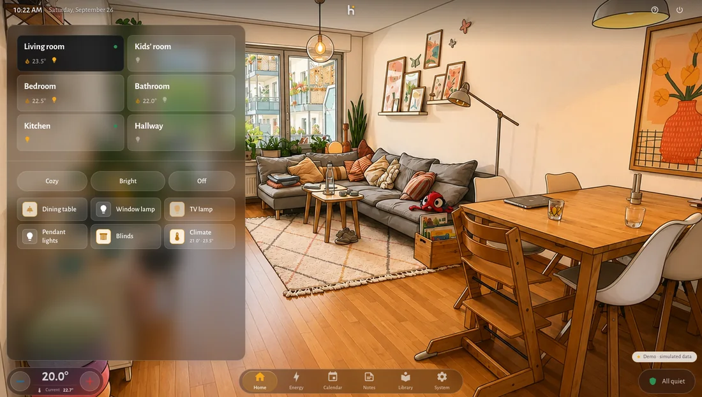
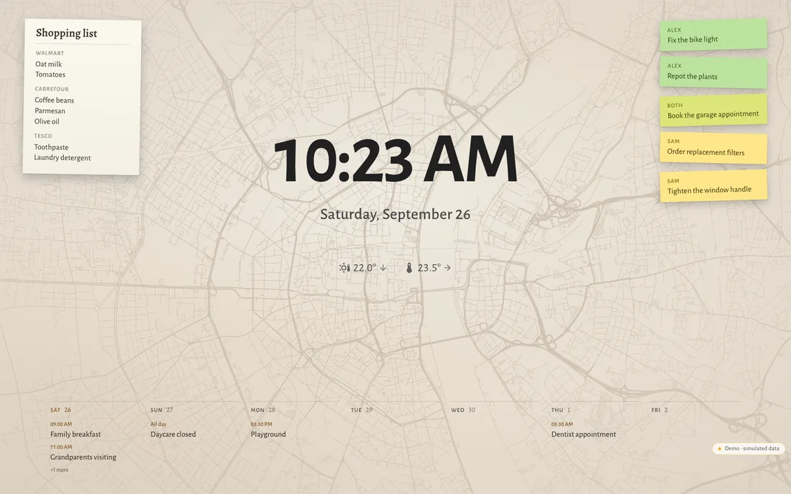
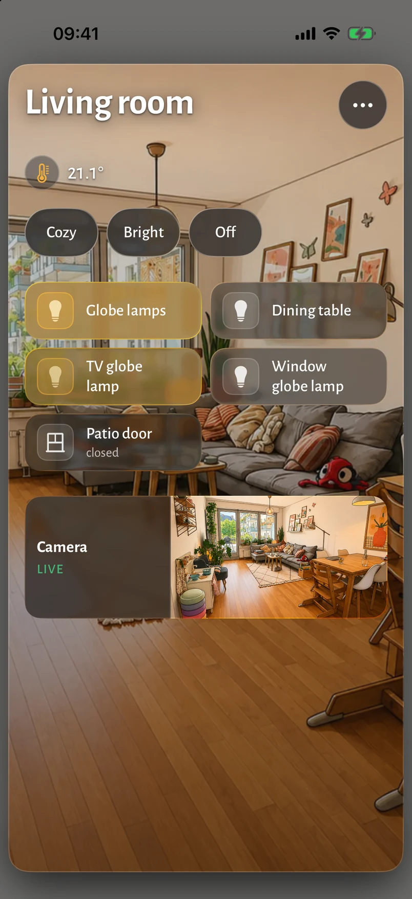

<div align="center">

<picture>
  <source media="(prefers-color-scheme: dark)" srcset="app/public/brand/hauser-logo-dark.svg">
  
</picture>

# Less interface. More home.

The everyday face of your smart home.<br>
For Home Assistant — and for Apple Home with the native iPhone and iPad app.

[**Open the demo →**](https://ralleur.github.io/hauser/demo/) · [Get Hauser](#installation) · [Read the guide](https://ralleur.github.io/hauser/docs/) · [Website](https://ralleur.github.io/hauser/)

**Free. Open source. Public beta.**

</div>

<picture>
  <source media="(prefers-color-scheme: dark)" srcset="website/media/home-dark-1100.webp">
  
</picture>

*The web demo, with simulated devices. [Explore it in your browser](https://ralleur.github.io/hauser/demo/) — nothing connects to your home.*

<a id="why-it-exists"></a>

## A room you recognise

Choose the living room. Set the lights. Get on with your evening. Hauser puts
rooms before device lists, with a picture of each space and its everyday
controls together.

<a id="what-it-does"></a>

- **Your rooms, in their own light.** Keep the bundled illustrations, upload
  your own pictures, or turn a photo into an illustration with the optional
  [room-image wizard](https://ralleur.github.io/hauser/docs/using/room-images/).
  Prepared day, evening and lights-off pictures follow the room’s state.
- **A useful wall panel at rest.** Standby brings the clock, week, notes and
  shopping list into view. A tap takes you back into the household.
- **Controls where you need them.** The web interface adapts to a phone. The
  native iOS app connects to your Hauser server or directly to Apple Home.
  Features depend on that connection.

Image providers process your selected photo outside your home and may require
paid access or have usage limits. Uploading existing pictures does not require
an image-generation account. [Compare the options](https://ralleur.github.io/hauser/docs/using/room-images/).

<a id="screenshots"></a>

<details>
<summary><strong>On the wall and in your hand — two more real views</strong></summary>



*Standby on the web panel. The optional map uses OpenStreetMap data.*



*The native iOS demo. [App guide and requirements](https://ralleur.github.io/hauser/docs/integrations/companion-app/).*

</details>

## Installation

### I use Apple Home

[**Join the iOS beta in TestFlight →**](https://testflight.apple.com/join/WPcA1eE1)

Install TestFlight, accept the invitation, open Hauser and choose **Apple Home**.
Allow access to your home. No Home Assistant or Hauser server is required.
The native app needs iOS 17 or newer; TestFlight builds expire and need updating.
[Read the app guide](https://ralleur.github.io/hauser/docs/integrations/companion-app/).

<a id="as-a-home-assistant-app"></a>
<a id="with-docker-compose"></a>

### I use Home Assistant

Install the Hauser server, then open its web interface. The setup wizard finds
your areas and devices and lets you arrange the rooms.

| Your installation | Start here |
| --- | --- |
| **Home Assistant OS or Supervised** | [Add the Hauser repository](https://my.home-assistant.io/redirect/supervisor_add_addon_repository/?repository_url=https%3A%2F%2Fgithub.com%2Fralleur%2Fhauser), install Hauser, then choose **Open Web UI**. [Step-by-step guide](https://ralleur.github.io/hauser/docs/getting-started/home-assistant-app/). |
| **Home Assistant Container, NAS or Docker host** | Use the versioned image and persistent volumes in the [Docker Compose guide](https://ralleur.github.io/hauser/docs/getting-started/docker-compose/). |

On iPhone or iPad, the native app can pair with this installation by QR code.
Home Assistant continues to manage your integrations, devices and automations.

**Keep the server on a trusted network.** Its web port has no separate login.
Do not forward it to the internet. See [remote access](https://ralleur.github.io/hauser/docs/integrations/remote-access/)
and [updates and backups](https://ralleur.github.io/hauser/docs/getting-started/updates-and-backups/).

<a id="beta-status"></a>

## Status and expectations

Current server release: [**v0.41.0**](https://github.com/ralleur/hauser/releases/tag/v0.41.0).
The native iOS app has its own TestFlight releases.

Hauser began on its maker’s wall panel and is still a personal project in
public beta. There is no subscription or Hauser account for everyday control.
Optional external services have their own accounts, data flows and terms.
Compatibility is growing; support has no guaranteed response time.

[Release notes](CHANGELOG.md) · [Feature status](https://ralleur.github.io/hauser/docs/overview/features/)
· [Roadmap](ROADMAP.md) · [Report a problem](https://github.com/ralleur/hauser/issues)

## Documentation

The [**Hauser guide**](https://ralleur.github.io/hauser/docs/) is organised around
what you want to do:

- **Get started:** [requirements](https://ralleur.github.io/hauser/docs/getting-started/requirements/),
  [first setup](https://ralleur.github.io/hauser/docs/getting-started/first-setup/)
  and [phones and panels](https://ralleur.github.io/hauser/docs/getting-started/phones-and-panels/).
- **Make it yours:** [rooms](https://ralleur.github.io/hauser/docs/using/rooms/),
  [room pictures](https://ralleur.github.io/hauser/docs/using/room-images/)
  and [standby](https://ralleur.github.io/hauser/docs/using/standby/).
- **Find an answer:** [FAQ](https://ralleur.github.io/hauser/docs/reference/faq/)
  and [troubleshooting](https://ralleur.github.io/hauser/docs/reference/troubleshooting/).

<a id="architecture"></a>
<a id="integration-status"></a>
<a id="advanced-configuration"></a>

For the implementation, see [architecture](https://ralleur.github.io/hauser/docs/developers/architecture/),
[configuration](https://ralleur.github.io/hauser/docs/reference/configuration/)
and the [technical documents](docs/). This repository contains the web app,
server, documentation and shared design tokens. The native SwiftUI app is
maintained separately.

## Running the developer build

```bash
git clone https://github.com/ralleur/hauser.git
cd hauser
npm ci --prefix app
npm run dev --prefix app
```

This opens the real interface with simulated devices. For an isolated Home
Assistant setup, use the [development pilot](docs/09-dev-pilot.md).

<a id="building-the-demo"></a>

The web app uses Svelte 5, Vite and TypeScript. [Developer setup](https://ralleur.github.io/hauser/docs/developers/setup/)
covers the static demo build; [tests and checks](https://ralleur.github.io/hauser/docs/developers/tests-and-checks/)
explains validation. Contributions follow [CONTRIBUTING.md](CONTRIBUTING.md)
and the [CLA](CLA.md).

## License

Code, design tokens and technical documentation: [AGPL-3.0-only](LICENSE).
Original illustrations and public screenshots: [CC BY 4.0](ASSETS-LICENSE.md).
The Hauser name and logos are covered by the [trademark policy](TRADEMARKS.md).
Fonts and other third-party assets retain their own licences; see [NOTICE](NOTICE).

<details>
<summary id="licensing-history">Licensing history</summary>

Releases through `v0.4.0-beta.6` remain MIT. `v0.4.0-beta.7` was published as
AGPL-3.0-or-later; releases from `v0.4.0-beta.8` use AGPL-3.0-only.
Earlier releases have not been withdrawn or retagged.

</details>

Hauser is an independent project, not affiliated with Home Assistant, Apple or Jellyfin.
